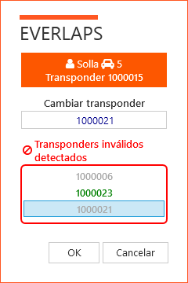

## &fa-bolt; Transponder ändern

Um den Transponder des Fahrers zu ändern ist es wichtig zu verstehen, wie everlaps Transponderaufgaben verwaltet.

### Transponder in der Fahrerliste (Transponder und Ränge)

Einserseits sind in der [Fahrerliste](../user-guide/drivers/index.html) die zu einem Fahrer gehörenden Transpondernummern abgelegt. Diese Werte dienen der Erleichterung der Zuordnung und Änderung des Transponders in der Nennungliste. ** Das Ändern eines Transponders in der Fahrerliste hat keinen Einfluss auf die vom Fahrer vorher getätigten Nennungen** (ausser im [Freien Training](../race-formats/free-practice/index.html) Hier wird bei jeder Durchfahrt die Transpondernummer direkt mit der Fahrerliste abgeglichen).

### Transponder in der Nennliste

Der dem Fahrer für ein Rennen zugeordnete Transpondernummer ist unabhängig von der Nummer, die in der Fahrerliste und anderen Rennen zugeordnet ist.

Ein Transponder kann schnell geändert werden, indem man in der Nennliste für den betreffenden Fahrer manuell eine neue Transpondernummer eingibt. In diesem Fall wird er automatisch auch in der Fahrerliste mit entspechender Klasse des Rennens hinzugefügt).

Wenn die Änderung an einer Nennung erfolgt, die zu einer aktiven Lauf gehört, wird ein Dialog angezeigt um die Änderung * on the fly * zu bestätigen.

Wenn eine Nennliste von der Everlaps-Website importiert wird (wo sich zuvor alle Teilnehmer für das Rennen angemeldet und ihre Transpondernummer angeben haben) entsprechen die Transpondernummern denen die die Fahrer in der Nennung im Portal angegeben haben - und nicht denen der lokalen Datenbank.

## Transponder on the fly ändern

Um die Transpondernummer eines Fahrers während des Rennens zu ändern, geht man idealerweise über die [Nennliste](../user-guide/races/index.html#inscripciones) des betreffenden Rennens. 

Eine andere Vorgehensweise ist es bei einem [aktiven Lauf](../user-guide/heats/index.html#situacion-de-la-manga-activa), dort können Sie die Transpondernummer ändern indem Sie mit der Maus auf die Zeile des Fahrers gehen und über die rechte Maustaste die Transponderänderung anwählen.

Der Dialog zeigt den Namen und die Fahrzeugnummer des ausgewählten Fahrers sowie den ursprünglichen Transponder an, der gegen in eine andere Transpondernummer geändert werden kann.

Wenn ein Fahrer mit einem im aktiven Lauf ungültigem Transponder nach Aktivierung des Laufes eine **Überfahrt über die Meßschleife** gemacht hat, zeigt das Programm dies im unteren Bereich des Bildschirmes durch eine graue Markierung der Überfahrt - mit Ausnahme der letzten Überfahrt, diese wird grün dargestellt. Die grau markierte Transpondernummer kann so einfach dem entsprechenden Fahrer zugeordnet werden.

!!! beachte ""

Während der Aufwärmrunden (von der Aktivierung bis zum Start) sind die Fahrer, die mindestens eine Überfahrt über die Maßschleife gemacht haben in der Ansicht des [aktiven Laufes](../user-guide/heats/index.html#situacion-de-la-manga-activa) mit einem grünen &fa-check; markiert. Dies zeigt an dass der Fahrer auf der Strecke ist und im Meßsystem erkannt wird.

Wenn es einen Fahrer mit ungültiger Transpondernummer im aktiven Lauf gibt, dann ist es einer von denen, die * nicht * mit einem grünen &fa-check; markiert sind.

