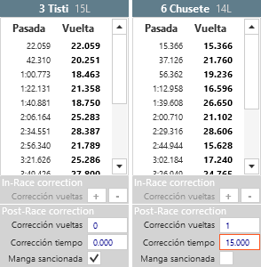
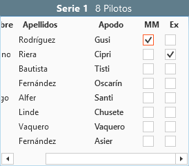

## &fa-legal; Strafen und Korrekturen

---

Es gibt verschiedene Arten von Bestrafungen und Korrekturen, jede muss in dem entsprechenden Abschnitt des Programms angewendet werden.

!!! beachte "Häufige Strafen Übersicht"
	- Bestrafungen/Korrekturen **spezieller Lauf**: siehe [verschiedene Bestrafungen im Lauf](#sanciones-a-nivel-de-manga)
	- Strafen **bester Lauf**: siehe [verschiedene Bestrafungen im Rennen](#sanciones-a-nivel-de-sesion)

---

#### verschiedene Bestrafungen/Korrekturen im Lauf

Diese werden durchgeführt im Abschnitt [Runden](../user-guide/heats/index.html#vueltas) Dort wo alle Runden des Fahrers gelistet sind, ist unterhalb ein Abschnitt, wo die Korrekturen angewendet werden. Es gibt zwei Typen nach dem Lauf-Zustand:

##### im Rennen

Ermöglicht die Korrektur der Gesamtzahl der Runden für einen Fahrer, während der Lauf im Gange ist. Diese Option wird normalerweise verwendet, wenn eine Überfahrt vom Decoder nicht erkannt wurde.

##### nach dem Rennen

Ermöglicht Korrekturen nachdem der Lauf beendet wurde. Die Optionen sind:

- **Runden**: Ermöglicht das Hinzufügen oder Entfernen von Runden für einen Fahrer. Die im In-Race-Bereich modifizierten Runden erscheinen hier automatisch, sobald der Lauf beendet ist.

- **Zeit**: Ermöglicht das Hinzufügen oder verkleinern der Gesamtzeit für den Lauf eines Fahrers.

- **Bestrafen**: bestraft mit dem Verlust des jeweiligen Laufresultates für den Fahrer 
	
	*Bei der Bestrafung eines bestimmten Laufes (in der Regel wird die Strafe auf den Lauf angewendet, der gerade beendet ist) rücken die Fahrer in der Position vor, die hinter dem bestraften Fahrer lagen.*

Alle Strafen haben eine sofortige Wirkung und das Ergebnis kann im Ergebnisabschnitt des Programms (Sitzung, Runde oder Läufe) oder durch das Drucken eines der Ergebnisse gesehen werden. Strafen erscheinen als Fußnoten zu den gedruckten Ergebnissen.

---

#### abgestufe Bestrafungen/Korrekturen für Sessions

Diese werden im Session Bereich für das entsprechende Rennen gemacht. Auf der rechten Seite der Fahrerliste stehen folgende Optionen zur Verfügung:

- **Bester Lauf**: Bestraft den Fahrer mit dem Verlust des besten Laufes der Session. Da der beste Lauf des Fahrers nicht bekannt ist bis alle Runden abgeschlossen sind, wird dieser beim Erzeugen der Rennergebnisse ausgewählt und die Strafe darauf angewendet.

	*Da der beste Lauf variieren kann, während die Session fortschreitet, werden die hinter dem bestraften Fahrer positionierten Fahrer nicht nach vorn platziert. Sollte dies gewünscht sein muss bis zum Ende der Sitzung gewartet und der beste Lauf direkt bestraft werden (Laufbestrafungen)*
	

- ** Ausgeschlossen **: Platziert einen Fahrer in letzter Stelle der Session und er wird von der automatischen Generierung neuer Gruppen ausgeschlossen.

---

#### Bestrafungen fürs Rennen

Diese werden aus dem Registrierungsbereich des Programms erstellt - es gibt nur eine einzige Option:

- ** Ausgeschlossen **: Platziert einen Fahrer in letzter Stelle in allen Sessions des Rennens und er wird von der automatischen Generierung neuer Gruppen ausgeschlossen.
