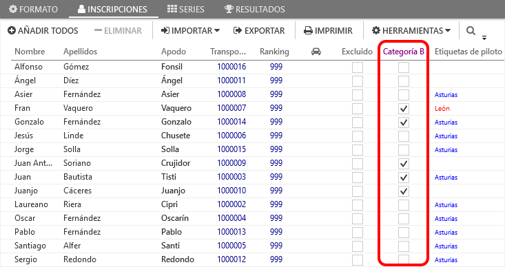

# :fontawesome-solid-tag: Marker

Everlaps ermöglicht die Erstellung von personalisierten Markern, die Fahrern und Rennen zugeordnet werden können

---

### dem Fahrer zugeordnete Marker 

Die den Fahrern zugewiesenen Marker erlauben es, Fahrer schneller über die Suchfelder zu finden bei [Fahrer](../user-guide/drivers.md), [Nennungen](../user-guide/races.md#inscripciones) oder [Gruppen](../user-guide/races.md#series).

Einige Beispiele für die Verwendung von Markern zum finden von Fahrern:

 * Vereine: Ermöglicht die Suche von Vereinsmitgliedern unter denen, die für das Rennen registriert sind
 * Regionen: Hier können Fahrer z.B. für eine regionale Meisterschaft zusammengefasst werden
 * Rennserien: Hier können Fahrer z.B. nach Teilnahme an einer Rennserie sortiert werden
 * Kategorien: Wenn das Endergebnis eine Unterscheidung haben soll, was die Kategorien betrifft (Junior, +40, etc ...) können diese Fahrer in der gleichen Gruppe sortiert werden

 ---
 
### Dem Rennen zugeordete Marker (Nennungen)

wenn Marker[Rennen](../race-formats/qualify-finals.md#etiquetas) zugeordnet werden, erscheint eine neue Zeile in der Ansicht der [Nennungen](../user-guide/races.md#inscripciones) view, Das ermöglicht es, dem jeweiligen Fahrer entsprechende Marker zuzuordnen, so dass während des Rennens unabhängige Ergebnisse durch Filtern der Marker erzeugt werden können!

Dieses System ermöglicht das Einführen einer Rennkategorie, die in ein andere zur Hauptwertung abeichende Wertung gestattet.

Beispiel:

 * Im Rennen wird eine Kategorie B * für Anfänger eingeführt. Alle Fahrer nehmen an der Qualifikation teil, aber beim Umstieg auf das Finale (oder Sub-Finale) ist es erforderlich, dass * Kategorie B * Fahrer ein unabhängiges Finale (in einer neuen Sitzung des gleichen Rennens) laufen. Bei der Erzeugung der Serie dieses Finals kann die Filterung durch den * Kategorie B * - Marker durchgeführt werden, so dass die automatische Generierung von Serien auf der Grundlage der Qualifikationsergebnisse nur die Fahrer dieser Kategorie berücksichtigt.

!!! note
    Wenn ein Marker einem Rennen zugeordnet ist und ein Fahrer diesem Marker zugewiesen ist, wird dieses Marker automatisch in der entsprechenden Spalte in der Fahrernennung markiert.
