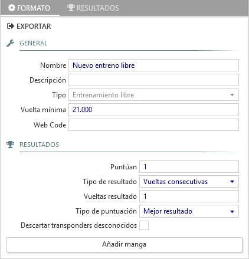

## freies Training 

Das freie Training funktioniert anders als die anderen Rennformate, die alle vorher eine Nennung benötigen und generierte Fahrer-Gruppen voraussetzen.

Im freien Training gibt es eine einzige Session und Gruppe, wo alle Fahrer die auf die Strecke gehen, an einem oder mehreren Läufen teilnehmen.

##### allgemeines

- **Name**: Titel für die Runde des freien Trainings der oben auf den Listen erscheint.

- **Beschreibung**: beschreibender Text der unten auf den Listen erscheint.

- **Typ**: beschreibt das Renn-Format, in diesem Fall *Freies Training*.

- **minimale Rundenzeit**: Minimale Rundenzeit für die jeweilige Strecke. Schnellere Runden werden automatisch als Abkürzung betrachtet und nicht gezählt.

- **Web Code**: notwendig um Livezeiten im [Everlaps-Portal](http://everlaps.com) zu veröffentlichen.

##### Ergebnisse

- **Punktewertung**: Anzahl der Läufe die für das Endergebnis der Fahrer herangezogen werden.

- **Ergebnisberechnung**: definiert auf welche Weise das Laufergebnis berechnet wird - siehe [Vorläufe und Finale](./qualify-finals/index.html)

- **Wertungstyp**: definiert auf welche Weise das Endergebnis aus den einzelnen Läufen berechnet wird - siehe [Vorläufe und Finale](./qualify-finals/index.html)

- **unbekannte Transponder verwerfen**: Wenn die Funktion aktiviert ist, werden Überfahrten mit nicht in der Datenbank registrierten Transpondern ignoriert.

!!! beachte ""
	Mehrere verschiedene freie Trainingsläufe sind in soweit nützlich, dass im Blick auf den ständigen Fahrerlistenzugriff alle Aufzeichnungen zurückgesetzt werden.

Wenn freier Trainingslauf gestartet wurde, gibt das Ansage-System die aktiven Fahrer mit den Rundenzeiten sowie die persönliche Bestzeit und die schnellste Runde für den Lauf aus. Jederzeit kann dabei eine Liste mit den derzeit schnellsten Runden der Fahrer gedruckt werden.

Wenn ein Fahrertransponder nicht registriert ist, werden die Runden während des Laufes angezeigt durch *Auto* zusammen mit den letzten 3 Ziffern des aktiven Transponders - die Runden werden aber nicht in der Datenbank gespeichert.

Während freier Trainingsläufe können Kurznamen und Transpondernummern direkt in der [Fahrerliste](../user-guide/drivers/index.html) angepasst werden. Diese Änderungen werden umgehend umgesetzt.

!!! beachte ""
	Wenn eine freier Trainingslauf manuell abgeschlossen wird, werden die Ergebnisse nicht gedruckt - selbst wenn die Option *Laufergebnisse automatisch am Ende jedes Laufes drucken* gewählt ist.

