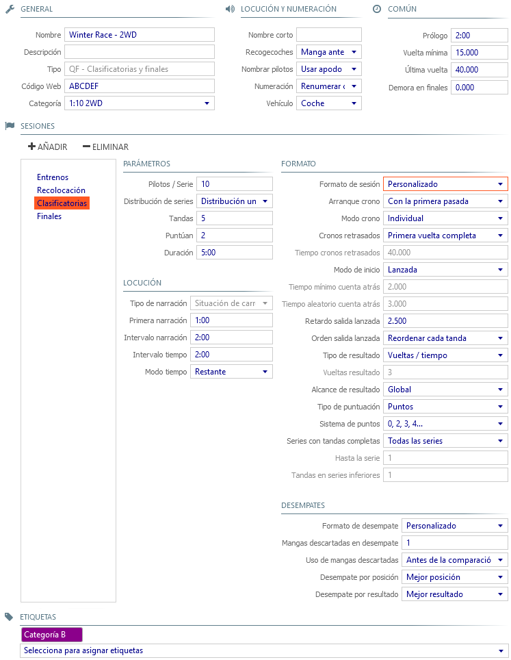

## Vorläufe und Finale

Das Rennformat * Vorläufe und Finale * definiert standardmäßig die Trainingssitzungen, Qualifikationen, Vorläufe und Finalsitzungen, die ersten beiden können entfernt werden, wenn sie nicht im Rennen eingesetzt werden.

---

##### allgemeines

- **Name**: Titel für das Rennen  der oben auf den Listen erscheint.

- **Beschreibung**: beschreibender Text der unten auf den Listen erscheint.

- **Typ**: beschreibt das Renn-Format, in diesem Fall *Vorläufe und Finale*.

- **Web Code**: notwendig um Livezeiten und Ergebnisse im [Everlaps-Portal](http://everlaps.com) zu veröffentlichen.

- **Klassen**: Identifiziert die Rennklasse damit der entsprechende Transponder bei einer manuellen Fahrerregistrierung gewählt werden kann.

---

##### Sprachansagen

- **Kurzname**: Kurzname, den der Ansager verwendet, um zu identifizieren, welches Rennen eine aktive Hitze gehört. Seine Verwendung wird nur empfohlen, wenn die Hitze von verschiedenen Rassen gemischt wird. (Zum Beispiel, wenn zwei Klassen am selben Tag laufen), so dass die Fahrer identifizieren können, welche der Klassen die aktive Wärme gehört.

- **Streckenposten**: Die Streckenposten können hier aufgerufen werden, sobald die Strecke für den Lauf geöffnet wurde und bevor er beginnt.
	
	- **kein Aufruf**: ruft die Streckenposten nicht auf.
	- **vorheriger Lauf**: ruft die Fahrer des vorangegangenen Rennens als Streckenosten auf

- **Fahrer aufrufen**: legt Fest wie die Fahrer angesagt werden bei den Positionen im Rennen, Endergebnissen...etc...
	
	- **Kurzname**: nutzt den Kurznamen des Fahrers zum Aufruf
	- **Startnummer**: nutzt die Starnummer des Fahrers zum Aufruf
	
- **Startnummern**: legt das Startnummernsystem für das aktuelle Rennen fest.

	- **jede Session neu nummerieren**: abhängig vom Sessionergebnis werden die Startnummern während des Rennens neu vergeben.
	- **feste Startnummern**: das Fahrzeug hat während des gesamten Rennens eine feste Startnummer ausgehend von der Nennung.

- **Fahrzeug**: legt den Typ des Fahrzeuges fest (Auto oder Moto)

---

##### gemeinsames

- **Warmup**: Zwischenzeit nachdem der (Start) Knopf gedrückt wurde bis zum Beginn des Laufes.

- **minimale Rundenzeit**: Minimale Rundenzeit für die jeweilige Strecke. Schnellere Runden werden automatisch als Abkürzung betrachtet und nicht gezählt.
 
	!!! beachte ""
		Die minimale Rundenzeit sollte so eng wie möglich festgelegt werden, da sie neben der Abkürzungserkennung für die Sprachausgabe der Positionen während des Qualify herangezogen wird

- **Letzte Runde**: Zeit zum Beenden der letzten Runde nachdem die Laufzeit um ist (oder das Ende der Qualify-Zeit erreicht ist). Entsprechend einiger Regelwerke sollte sie 150% der rechnerischen Rundenzeit nicht übersteigen.

- **Finale Überfahrt Verzögerung**: legt die Zeit fest, in der nach Finalstart keine Überfahrten registriert werden - dies ist nützlich wenn die Maßschleife die Startaufstellung kreuzt

---

#### Sessions

##### mögliche Aktionen

- **hinzugfügen**: fügt ein neues Training, Qualify (sofern noch nicht vorhanden) oder benutzerdefiniertes Rennformat hinzu.
- **löschen**: löscht die gewählte Session.

---

##### Einstellungen

- **Fahrer/Gruppe**: maximale Anzahl an Fahrern jeder Gruppe in Sub-Finals oder Finale für die automatische *Generiere* Option im Tab [Gruppen](../user-guide/races/index.html#series). Im Gruppenmanagement kann die Fahrerverteilung aber auch per drag and drop total frei erfolgen...

- **Gruppenaufteilung**: gibt an wie die Fahrer unter Berücksichtigung des Wertes *Fahrer/Gruppe* in die Gruppen der einzelnen Läufe verteilt werden.

	- **komplett in Reihenfolge**: Füllt die Gruppen nacheinander mit dem Wert *Fahrer/Gruppe*. Dies wird normalerweise in den Finals verwendet um diese voll besetzt zu bekommen - nur die letzte Gruppe ist hier kleiner.
	 
		*Bei einem Rennen mit 26 Fahrern mit z.B. 10 Fahrer/Gruppe werden 3 Gruppen generiert: A B und C mit 10, 10 und 6 Fahrern.*
 
	- **gleichmäßige Verteilung**: Füllt die Gruppen gleichmäßig mit dem Wert *Fahrer/Gruppe*. Dies wird normalerweise in den Vorläufen verwendet in allen Gruppen gleichmäßig viele Fahrer auf der Strecke zu haben.

		*Bei einem Rennen mit 26 Fahrern mit z.B. 10 Fahrer/Gruppe werden 3 Gruppen generiert: A B und C mit 7, 7 und 8 Fahrern.*

- **Durchgänge**: die absolute Anzahl an Läufen pro Serie.

- **Wertung**: die gewertete Anzahl an Läufen pro Serie.

- **Dauer**: Auer jedes Laufes.

---

##### Sprachausgabe

- **Srachausgaben-Typ**: Legt die Informationen fest, die während des Rennens per Sprachausgabe durchgegeben werden.

	- **Rennsituation**: In regelmäßigen Abständen werden die Rennsituation, Fahrerpositionen und Abstand zwischen den Fahrern angesagt.
	
		!!! beachte ""
			Da in den Vorläufen jeder Fahrer eine eigene Rennzeit hat, kann es zwischen den Sprachausgaben für jeden Fahrer in Abhängikeit des Abstandes zum nächsten Fahrer kleine Pausen geben.
	
	- **Position bei Überfahrt**: Jedes Mal, wenn ein Fahrer die Meßschleife überquert, wird die Fahrerposition ausgegeben. Dieser Modus wird nur auf das Finale angewendet, da alle Fahrer eine gemeinsame Startzeit haben.
	
	- **gemischt (Position bei Überfahrt + Rennsituation)**: gibt die *Position bei Überfahrt* und regelmäßig auch die *Rennsituation* aus.
	
	- **keine Sprachausgabe**: es erfolgen bezüglich der Rennsituation und Position im Rennen keine Sprachausgaben.

- **erste Platzierung**: Zeit nach Start des Laufes bevor die erste Platzierung angesagt wird - das Fahrerfeld sollte bei diesem Wert mindestens eine Runde absolviert haben. 

- **Platzierung**: Intervall zwischen den einzelnen Ansagen der Platzierung nach dem die erste Ansage erfolgt ist.

- **Rennzeit**: Intervall zwischen den einzelnen Ansagen der Rennzeit nach dem die erste Ansage erfolgt ist.

- **Rennzeit Modus**: setzt den Rennzeitmodus für die Sprachausgabe der *Rennzeit*

	- **abgelaufen**: gibt die abgelaufene Zeit seit Beginn des Laufes aus.
	- **verbleibend**: gibt die verbleibende Zeit bis zum Ende des Laufes aus.

---

##### Format

- **Sessions-Format**: legt die Einstellung für die Zeitmessung in allen Abschnitten des Rennens fest

	- **Vorläufe beste aufeinanderfolgende Runden**: Dies wird normalerweise für das Qualify zu den Läufen verwendet. Jeder Pilot startet mit dem ersten Durchgang der Ziellinie seine eigene Zeitmessung, die Summe der 3 schnellsten aufeinanderfolgenden Runden wird dann gewertet. Diese Anzahl Runden (in dem Beispiel 3) wird als Wert in *Rundenergebnis* festgelegt.

	- **Vorläufe gestaffelter Start (Punktewertung oder bestes Ergebnis)**: Das System ruft jeden Fahrer einzeln entsprechend seiner Session-Position nach einem im Feld *Abstand verzögerter Start* angegebenen Zeitintervall zum starten auf. Wurde die Punktewertung gewählt, so ist im Feld *Punkte-System* zusätzlich die gewünschte Punkteverteilung zu setzen.

	- **Vorläufe fliegender Start (Punktewertung oder bestes Ergebnis)**: vergleichbar zu den vorherigen Schemas, mit dem Unterschied, dass sich die Fahrer aus den Aufwärmrunden heraus direkt ins Rennen starten. Die individeuelle Zeitmessung beginnt, sobald der Fahrer das erste Mal die Meßschleife passiert.
 
	- **Finale (Punktewertung oder bestes Ergebnis)**: Start aus der Startaufstellung in Reihenfolge der Rennpositionen. Die Zeitmessung beginnt mit dem Start durch einen Signalton.
	
	- **Training (Punktewertung oder bestes Ergebnis))**: vergleichbar zum fliegenden Start in den Vorläufen, nur startet die Zeitmessung mit dem Signalton anstelle auf die erste Überfahrt zu warten.
	
!!! beachte ""
	Das Format kann modifiziert werden, selbst wenn die Session bereits ausgeführt wurde! Das System berechnet dann die Ergebnisse anhand der neuen Parametern und den aufgezeichneten Runden neu.

##### benutzerdefiniertes Format

dies erlaubt die freie Konfiguration jedes Rennparameters

- **Messung starten**: definiert wann die Zeitmessung gestartet wird

	- **bei Signalton**: Die Zeitmessung startet mit dem Signalton.
	- **bei erster Überfahrt**: Die Zeitmessung startet bei der ersten Überfahrt eines der Fahrer über die Meßschleife.
	
- **Messmodus**: definiert den individuellen Meßmodus

	- **individuell**: jeder Fahrer wird einzeln gemessen (Vorläufe).
	- **gemeinsam**: Die Zeitmessung startet für alle Fahrer gemeinsam (Finals).

- **Verzögerung Zeitmessung**: definiert den Start der Zeitmessung für Fahrer, die nach Rennstart die Meßschleife noch nicht passiert haben.

	- **erste komplette Runde**: die Zeitmessung startet sobald der erste Fahrer seine erste Runde abgeschlossen hat.
	- **verzögert**: die Zeitmessung beginnt nach der bei *Verzögerung Zeitmessung* eingegebenen Zeit nachdem der Lauf gestartet wurde.

- **Verzögerungszeit**: gibt beim Modus *verzögert* an, nach welcher Zeitspanne die Zeitmessung für Fahrer beginnt die nach Rennstart die Meßschleife noch nicht passiert haben.

- **Start Modus**: Definiert die Art des Startes der Läufe.

	- **Startreihen**: Das System führt einen Countdown aus bei dem nach Ablauf und Zufallsverzögerung der Start durch Signal erfolgt.
	- **gestaffelt**: Das System lässt jeden Fahrer einzeln starten.
	- **fliegend**: während der Einführungsrunden wird ein interner Countdown ausgeführt nach dem der fliegende Start für jeden Fahrer auf der Strecke erfolgt.

- **minimale Countdownzeit**: Only for *Startreihen* mode, minimum time delay after last number in the count down, before the start horn.

- **Zufalls-Countdown**: Only for *Startreihen* , random time delay after minimum count down time, before the start horn. *For example, a configured minimum count down time of 2 seconds, and a random count down time of 3 seconds, would mean that after the countdown from 10 to 3, the program will wait between 2 and 5 seconds to sound the start horn.*

- **Verzögerung gestaffelter Start**: For *gestaffelt* mode only, indicates the time delay between calls to drivers.

- **Reihenfolge gestaffelter Start**: Defines if in each round the start order is recalculated depending on session results.

	- **Re-order each round**: Enables re-ordering. This is the default option for staggered start.
	- **Fixed order**: Maintains the same order in all the rounds.

- **Results type**: Defines the values which are used to calculate the session results:

	- **Laps / Time**: Total amount of laps and time are used to calculate.
	- **Consecutive Laps**: Least amount of time to complete N consecutive laps (Re-ordering).
	- **Fixed Laps**: Amount of time to complete a fixed number of laps (Formula 1 type).

- **Result laps**: Number of laps to count for *consecutive laps* and *fixed laps* modes.

- **Results scope**: Defines the group of drivers included in session results.

	- **Global**: All drivers are taken into account for general classification (qualifying).
	- **Per series**: Only drivers from the same series are used (Finals).

- **Points type**: Establishes the session points type

	- **Points**: A system of points is established for the session results. By default for electric vehicles position obtained in each round (0, 2, 3… for qualifying ; 1, 2, 3... for finals)
	- **Best result**: Best result is chosen laps/time position having no bearing.

- **Points system**: Establishes points system among those supported by the program.

- **Series with complete rounds**: Establishes how many heats count in each series. This is useful for, for example, finals permitting the A series to run 3 rounds of finals counting 2, leaving the series B onward to run a single final.

	- **All series**: All series score points with the same number of heats. There is no difference between series with respect to number of rounds and heats which score points.
	
	- **Premier series**: Only premier series score points in the heats established in the general configuration for the session, the rest the value established in *Lower series rounds*.
	
		- **Until series**: Defines Until what series (inclusive) all the heats are run. For example if only 3 rounds of finals are required for series A, this value should be 1.
		- **Lower series rounds**: Number of rounds that score points for the lower series. For example series below A only score points in 1 heat.

---

##### Gleichständler

Diese Funktion ermöglicht die Rangeinteilung der Fahrer bei gleichem Ergebnis / gleicher Punktzahl nach Abschluss der gültigen Läufe (Gleichstand) 

- **Gleichstandsformat**
	- **standard**: nur gültige Läufe werden genutzt und es werden dort die Positionen der Gleichständler verglichen
	- **benutzerdefiniert**: hier können benutzerdefinierte Regelungen zur Behebung des Gleichstandes festgelegt werden.
	
##### benutzerdefinierte Gleichstandsauflösung

- **verworfene Läufe bei Gleichstand**: Gibt die Anzahl an verworfenen Läufen an die zur Auflösung des Gleichstandes herangezogen werden. Der Wert 0 bedeutet keine.
- **verworfene Läufe nutzen**: gibt an in welchem Moment die verworfenen Läufe mit herangezogen werden.
	- **vor dem Verlauf der gültigen Läufe**: Die individuellen Ergebnisse aus den verworfenen Läufen werden VOR dem Vergleich der gültigen Läufe angewendet.
	- **nach dem Verlauf der gültigen Läufe**: Die individuellen Ergebnisse aus den verworfenen Läufen werden NACH dem Vergleich der gültigen Läufe angewendet.
	
		*Wenn sich beispielsweise ein Gleichstand ergibt bei 5 Vorläufen und davon 3 gewerteten, dann werden zur Auflösung nacheinander auch der 4. Lauf und der 5. Lauf herangezogen - und dies je nach Wahl vor bzw nach dem Vergleich der Positionen in den 3 gewerteten Läufen.*    

- **Position Gleichstand**: Establishes the mode of individual comparison by position obtained in each heat (nur bei Punktewertung)
	- **beste Position**: Vergleichsmodus auf der Grundlage der entsprechend der Position erhaltenen Punkte.
	- **nicht verwenden**: keine Nutzung der Position für Gleichstände.
- **Ergebnis Gleichstand**: setzt den Modus für die Gleichstandsauflösung auf die individuellen Ergebnisse aus Runden/Zeit für jeden der Läufe.
	- **bestes Ergebnis**: zieht das beste Ergebniss aus Runden/Zeit zur Auflösung heran...
	- **kombinierte Ergebnisse**: zieht die Summe der Ergebniss aus Runden/Zeit aller gültigen Läufe zur Auflösung heran...
	
!!! beachte "Gleichstandsauflösung durch Einzelvergleich"
	Für der Fall dass mehrere Fahrer die gleichen Punkte (oder Runden/Zeit) haben, ist der Modus der Gleichstandsauflösung wie folgt:

	- Der Fahrer mit der besten Position im Lauf gewinnt. Wenn der Gleichstand anhält, wird die zweitbeste Lauf verwendet, und so weiter (nur für gültige Läufe und nur wenn das Ergebnis nach Punkten ermittelt wird)
	- Wenn der Gleichstand weiterhin existiert, gewinnt der Fahrer mit dem besten Ergebnis (Runden/Zeit) im besten Lauf. Wenn der Gleichstand weiterhin existiert, die wird der zweitbeste Lauf verglichen, und so weiter (nur für gültige Läufe)

---

#### Marker

erlaubt das Hinzufügen von Markern zum Rennen - für nähere Informationen siehe [Marker](../common-tasks/tags/index.html) section.

- **Neuberechnen der Ergebnisse für die nach Marker gefilterten Werte**: wenn aktiviert, werden beim darauffolgenden Erzeugen der Ergebnisse nur die Fahrer mit den angegebenen Markern zur Berechnung herangezogen - damit können z.B. Altersgruppenwertungen innerhalb des Rennens parallel erzeugt werden. 
