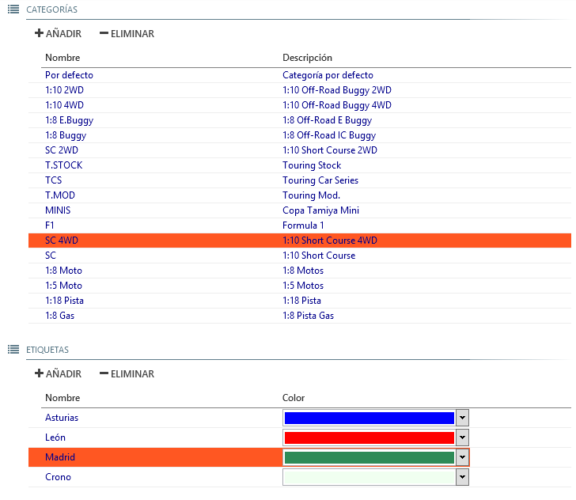

## &fa-gears; Konfiguration

erlaubt die Einstellung der allgemeinen Programmparameter

## Optionen der Konfiguration

--- 

#### &fa-microphone; Stimmen

Everlaps benötigt für vollen Funktionsumfang die Installation synthetischer Stimmen *TTS (Text To Speech)*. Zwei der bekanntesten Anbieter sind *Ivona* und *Loquendo*, darüberhinaus kann Everlaps mit jedem *TTS* SAPI5 kompatiblen System zusammenarbeiten.

- **Erststimme/Zweitstimme**: Erlaubt die Auswahl der Stimmen aus den im Betriebssystem installierten Möglichkeiten. Für eine bessere Verständlichkeit ist eine weibliche Stimme besser als Erststimme geeignet und die männliche als Zweitstimme (Marianne und Hans mit Ivona, oder Kate and Simon mit Loquendo).

- **Geschwindigkeit**: der Schieberegler steuert die Geschwindigkeit der einzelnen Stimmen. Je nach Stimmbild sollte durch justieren und Testen das Stimmenverhalten angepasst werden.

- **Lautstärke**: der Schieberegler steuert die individuelle Stimmlautstärke der Ansagen.

- **Test**: jeder hier eingegebene Text wird nach drücken der ENTER Taste automatisch ausgegeben. *diese Funktion ist nicht nur zum Testen wichtig sondern auch sehr nützlich für Ansagen über die Streckenlautsprecher*.

- **Stimm-Kompatibilitätsmodus**: aktiv  ***nur*** wenn anderweitig keine Stimme zu hören ist. *siehe weiter unten*.

	!!! Achtung !!! "Stimmkompatibilität: Loquendo 6.5"
		bei älteren Versionen von Loquendo (6.5 oder früher) gibt es einen Fehler bei der Sprachkontrolle durch Drittprogramme wie Everlaps. Nur in diesem Fall sollte der *Stimm-Kompatibilitätsmodus* aktiviert werden. 
	
		Dieser Fehler kann getestet werden, indem man die entsprechende Loquendo-Stimme auswählt und in der Testbox folgendes schreibt:
	
			Eins <Stille msec="1000"/> Zwei
	
		Wenn Sie hier *Eins Zwei* mit einer 1 Sekunde Pause dazwischen hören, ist der Fehler nicht vorhanden und die Auswahl des Kompatibilitätsmodus ist nicht notwendig; Wenn nur *Eins* gehört wird, dann ist es notwendig, den *Stimm-Kompatibilitätsmodus* zu aktivieren.
---

#### &fa-bell-o; Töne

Jeder Systemklang kann durch diesen Regler einzeln entsprechend den Bedürfnissen eingestellt werden.

- **Überfahrt**: erklingt bei einer gültigen Überfahrt über die Meßschleife (außer wenn es das Fahrzeug das des Führenden ist oder wenn der Lauf beendet ist)

- **Führender**: Wenn das Fahrzeug mit den meisten Runden die Ziellinie kreuzt, wird ein intensiverer Klang ausgegeben, der dem Rennleiter und dem Publikum helfen kann, zu erkennen wer der Fahrer mit den meisten Runden ist. 

	!!! note ""
		In einem * Finale * ist der Sound vom Führenden gleichbedeutend mit dem des schnellsten Fahrers.
	
		In einem *Vorlauf*, da hier jeder Fahrer seine eigenen Zeit hat ist der Führende nicht der, der zuerst die Ziellinie überfährt.

- **Lauf Start/Lauf Ende**: signalisiert den Start bzw. das Ende des Laufes.

	!!! beachte ""
		In einem * Finale * bedeutet der Laufstart-Sound im Allgemeinen den Beginn der Zeitmessung. Der Klang für das Laufende signalisiert jedoch, dass für alle Fahrzeuge nach ihrer DARAUFFOLGENDEN Überfahrt der Mess-Schleife der Lauf endet.
	
		In eine * Vorlauf * signalisiert der Laufstart-Sound dass die Strecke offen ist - aber die Zeitmessung erfolgt erst wenn der erste Fahrer die Mess-Schleife überfährt. Der Klang für das Laufende signalisiert NICHT das allgemeine Laufende sondern die Phase des individuellen Laufendes. Das Rennen wird fortgesetzt bis jeder Fahrer entsprechend seiner Rennzeit eine persönliche Ankündigung des Laufendes gesagt bekommt. (Bsp: Max fertig...) 

- **ungültige Transponder**: wird ausgegeben wenn eine Überfahrt mit einem Transponder erkannt wird der zu keinem Fahrer im aktiven Rennen zugeordnet werden kann.

---

#### &fa-bolt; Transponder

Das System unterstützt verschiedene Transponder und ihre Decoder-Systeme

- **Decoder/Parametes**: Ermöglicht die Auswahl des Decoders und seiner Verbindung. Die verfügbaren Optionen sind:

	- **IPDecoder**: Anschluss von AMB/MyLaps oder alternativen Decodern über das Netzwerk via IP-Protokoll. Im Feld ** Einstellungen ** istes erforderlich, die Decoder-IP-Adresse anzugeben (zB 192.168.0.10)

	- **seriellerDecoder**: Anschluss von AMB/MyLaps oder alternativen Decodern über die serielle Schnittstelle. Im Feld ** Parameter ** ist es erforderlich, anzugeben an welchem seriellen Port der Decoder angeschlossen ist (COM1, COM2, etc ...)
	
	- **SimulatorDecoder**: startet nach Auswahl und Programmneustart einen Überfahrts-Simulator im Zusatzfenster. Mit diesem Tool kann man testweise Fahrerüberfahrten erzeugen, indem man die entsprechenden Transpondernummern aktiviert und die Zeitspanne zwischen den Überfahrten konfiguriert. (beachte: auf die passende minimale Rundenzeit in den Einstellungen des Testlaufes achten) 
	
	- **NullDecoder**: wenn keine Decoderverbindung eingerichtet ist, wird mit dieser Einstellung keine Schnittstelle abgefragt.
	
- **Filter wenn Hits/Signal niedriger als...**: für Verbindungen zu AMB/MyLaps Decodern oder kompatiblen Geräten ignoriert Überfahrten mit hit/signal Werten kleiner als angegeben

- **Ungültige Transponder zum Laufstart erlauben**: wenn nicht angewählt werden nur gültige Transponder zum Start der Zeitmessung bei der ersten Überfahrt erlaubt (bei den Vorläufen über fliegenden Start). Wenn die Funktion aktiv ist, können auch ungültige Transponder diesen Lauf starten. 
	
	!!! beachte ""
		Erlaubt einen ungültigen Transponder, um die Zeitmessung zu starten. Der ungültige Transponder kann nachträglich einem Fahrer zugewiesen werden und alle Runden (einschließlich der ersten Überfahrt) können automatisch wiederhergestellt werden.

- **manuelle Zählung erlauben**: Erlaubt die Programmoption des manuellen Zählens von Fahrern ohne Transponder.

	- **Abkürzungen bei manueller Zählung erkennen**: Wenn aktiviert werden auch bei manueller Zählung Abkürzungen erkannt und die Runden dann als nicht gültig gewertet.

	- **Hot Keys erlauben**: Erlaubt die Nutzung der Hot Keys **F1 to F12** (Fahrer 1 bis 12) und **Ctrl+1, Ctrl+2 to Ctrl+0** (Fahrer von 11 bis 20) um einfach manell zu zählen ohne die Maus zu nutzen.

		!!! beachte "Hot Keys beim manuellen Zählen"
			Die Tasten F1 bis F12 und alle Kombinationen incl. der Ctrl+NUM Funktion sind dann exklusiv genutzt auch wenn Everlaps läuft aber nicht im Vordergrund aktiv ist.

---

#### &fa-print; Drucken

- **Rennzeit in Runden Detail mit drucken**: Direkt neben der Rundenzeit wird beim Aktivieren dieser Option die entsprechende aktuelle Rennzeit mit ausgegeben.

- **Ausdruck mit Positionen während des Laufes hinzufügen**: Wenn diese Funktion aktiviert ist, wird am Ende des Laufberichtes eine Grafik mit den Positionswechseln während des Rennens mit ausgegeben.

- **Automatischer Ausdruck nach Lauf-Ende**: Nach Ende jedes Laufes werden die Ergebnisse automatisch gedruckt, genau wie die Ergebnisse der Runden und der Sessions (im Falle der abgeschlossen Lauf beendet die jeweilige Runde oder die jeweilige Session).

- **PDF-Viewer für Vorschau und Druck**: Beim Drucken eines Berichtes wird dieser als Vorschau in dem auf dem Betriebssystem konfigurierten PDF Viewer ([Foxit Reader](http://www.foxitsoftware.com/Secure_PDF_Reader), [Adobe Reader](http://get.adobe.com/es/reader), etc...) ausgegeben.

- **Drucker**: nutzt den hier gewählten Drucker für die Listen- und Ergebnissausdrucke sofern der *PDF-Viewer für Vorschau und Druck* nicht aktiv ist.

---

#### &fa-gear; Standardoptionen

- **Einführungszeit/minimale Rundenzeit/letzte Rundenzeit/Verzögerung Zeitmessung/Startverzögerung**: Diese Werte werden automatisch bei neu angelegten Rennen in die [Rennkonfiguration](../race-formats/qualify-finals.md#comun) eingelesen. 

- **Nummerierung der Trainings- und Vorlaufgruppen umkehren**: Voreingestellt werden die Gruppen von 1 aufwärts nummeriert, 1 ist die Gruppe mit den Fahrern des höchsten Ranking und fährt zuerst, im der umgekehrten Nummerierung ist die erste Gruppe die mit dem geringeren Ranking und fährt zuerst.  

	!!! beachte ""
		Die Reihenfolge der Läufe in Everlaps muss nicht streng befolgt werden, der Zeitmesser kann wählen, welchen Lauf er aus der aktuellen Runde startet.

---

#### &fa-signal; Netzwerk

- **Ergebnisse automatisch in everlaps.com veröffentlichen**: Sobald ein Lauf beendet ist, werden die Ergebnisse auf [Everlaps](http://everlaps.com) aktualisiert sofern der passende *Web code* eingetragen wurde.

	!!! beachte ""
		Wenn diese Funktion aktiv ist, und nach dem Ende des Laufes Bestrafungen und Kerrekturen angewendet wurden, müssen die Ergebnisse erneut manuell veröffentlicht werden über (Liste der Rennen > Rechtsklick auf das Rennen> Ergebnisse auf eververlaps.com veröffentlichen)

---

#### &fa-rss; Live Timing 

Everlaps kann die Laufergebnisse *in Echtzeit* über den integrierten Webserver und WLAN zu veröffentlichen. Damit ist es möglich, das aktulle Renngeschehen auf allen mobilen browserfähigen Geräten wie SmartPhones, Tablets etc. auszugeben. 

Sowohl für die Fahrer, die Boxencrew, die Zuschauer und auch die Rennleitung selber ist dieses *Live Timing* System damit äußerst informativ und nützlich.

- **Veröffentlichen auf lokalem Server**: erlaubt das senden der Renndaten zum einem lokalen Server der als Dienst auf dem lokalen Rechner (auf dem auch Everlaps läuft) - diese Option ist die einzig mögliche im Freeware-Modus

	!!! note "lokaler Server"
		Der lokale Server ist ein unabhängiges Programm welches parallel zum WiFi-Netz gestartet sein muss um Live Timing zu senden. Es ist im Everlaps Ordner zu finden und als Link auf dem Desktop als grünes Icon mit Beschriftung *Everlaps Live Timing*.
 
- **Veröffentlichen auf everlaps.com**: erlaubt das Senden des [Everlaps Live Timing](http://live.everlaps.com) während des Renntermines auf der Hauptseite der Website.

- **persönliche Server**: erlaubt das Senden der Renndaten an unterschiedliche Server IP-Adressen (getrennt durch Leerzeichen).

- **Zeige Tanktimer**: Zeigt im [Live Timing](http://live.everlaps.com) (remote und local) eine Liste mit verschiedenen Tankstrategien und die verbleibende Zeit für jeden Boxenstop.

	- **minimale/maximale Zeit zwischen den Tankstopps**: Entsprechend der Renndauer, den hier angegebenen Werten und der möglichen Fahrzeit ohne Tanken werden hieraus Tankstrategien errechnet.

- **Fernsteuerung erlauben**: Erlaubt die Fernsteuerung der Läufe über einen Client des Live Timing. *Diese Option ist derzeit deaktiviert*.

	- **User/Password**: Zugangsdaten für das *Live Timing* um dem Client die Erlaubnis zur Rennsteuerung zu geben.

---

#### &fa-database; Dateien

- **Datenbank**: Zeigt den Pfad zur Datenbank wo alle Konfigurationen, Fahrer- und Renndaten gespeichert werden. Dieser Pfad kann geändert werden, wenn z.B. die auf einem anderen Rechner erstellte und kopiert Rennkonfiguration genutzt werden soll. 

- **Logo**: Zeigt den Pfad zum Logobild welchesauf den Rennreports mit gedruckt wird.

---

#### &fa-globe; Sprache

Erlaubt das Ändern der Systemsprache von Everlaps

!!! beachte ""
	die Software der Sprachausgabe muss der konfigurierten Programmsprache entsprechen.

---

#### &fa-bug; Debugging

- **Zeige Konsole**: Zeigt die Logbucheinträge des Programmes (Sprachausgabe, Aktionen, Fehler...). Im Falle eines Problems kann dies nützlich sein um die ursache für aufgetretene Probleme zu finden.

## Klassen und Marker 

#### &fa-list; Klassen

Erlaubt das hinzufügen, löschen und modifizieren der Klassen. Voreingestellt ist eine Liste mit den meistgenutzten Klassen, diese kann angepasst werden - jedoch kann die Standardklasse nicht gelöscht werden.

#### &fa-list; Marker

Erlaubt das hinzufügen, löschen und modifizieren der Marker und das Zuordnen einer Farbmarkierung und Beschreibung.

Die Nutzung der Marker wird im Detail erklärt in der Sektion [Marker](../common-tasks/tags.md) section.
