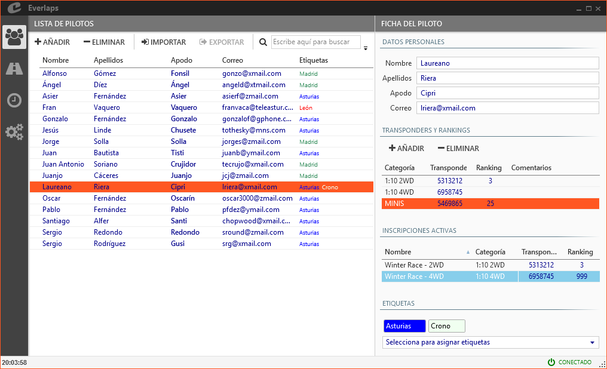

## &fa-users; Drivers

Allows the management of all the drivers available in the programs database.

Glossary of terms used to manage the drivers:

- **Driver**: An Individual that can be registered in any of the configured races
- **Classes**: Classifies The different classes according to vehicle type
- **Transponder**: Personal transponder number used by the lap counting system to identify a driver
- **Ranking**: A driver ability in relation to all the rest
- **Tag**: Allows you to group drivers with a common identifier    

A driver can have assigned different transponder or ranking according to the classes that will be raced in, also any tag number defined in the program.

---

### Drivers list

Permits adding, deleting or modifying the available drivers.

##### Actions

- **Add**: Inserts a new line in drivers list ready to be filled out with driver data.

- **Delete**: Removes selected driver or drivers from the data base. 

- **Import**: loads a list of drivers from a file.

- **Export**: saves a list of drivers to a file.

- &fa-search; **(Search)**: Performs a search upon the drivers visible, showing matches or partial matches (name, surname, transponder, category, tags etc...)  to the text input in the search field.

##### Fields

- **Name and Surname**: Will appear in the list to positively identify the driver.

- **Nick name**: Nick names will be used by the voice announcements to narrate times and position of the drivers, as on the detailed race reports. There can be duplicate Nick names in the data base, but they are no allowed in the same heat (The program will issue a warning so that they can be modified).

- **email**: The email address is the means by which the program identifies the drivers between the local database and the one available in internet [Everlaps web site](http://everlaps.com), so that race registration and results can be managed for each driver bidirectionally.

	When drivers are manually added, it is important to add the email address correctly in case they are already registered on [Everlaps](http://everlaps.com) so that the results are assigned correctly.

- **Tags**: Shows all the tags assigned to a driver.

---
	
### Driver card

Shows all the information about a driver, including personal data mentioned earlier, lists of transponders and rankings per class, active races  the driver is participating in, and any tags assigned.

#### Transponders, rankings and vehicle numbers

Manage the drivers list of transponders, rankings and vehicle numbers according to the classes that are being participated in.

- **Classes**: Allows selection among the available [Classes](./config/ind	ex.html#categorias), in the list.
- **Transponder, rank and class**: Allows assignment of values corresponding to a driver in the class selected.

!!! note ""
	When registering a driver manually in a race, the system compares the classes of the race with the classes assigned to the driver to assign the corresponding transponder. In case there is no match, the default transponder is assigned for that class. 

#### Active registrations

List of races marked as active, that a selected driver is participating in.

Its possible to modify the transponder and rank of the selected registered driver, the same way that it would be done in [Registrations](./races/index.html#inscripciones) section.

#### Tags

Show the tags assigned to a driver.

The tags allow the filtering and grouping together of drivers quickly within the different classes. (drivers list, registrations, heats...).

Any tag can be assigned from the lower drop down, and can be removed by clicking on the *X*  that appears when the cursor is above the tag to be removed. The complete list is defined in the [Tags](./config/index.html#etiquetas) section.

