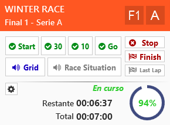
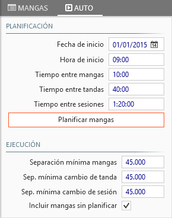
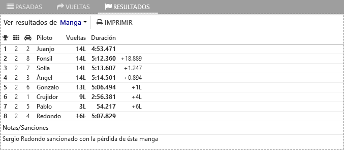

# :fontawesome-regular-clock: Läufe

Die Abwicklung der Rennläufe wird hierüber kontrolliert, Die Läufe werden in der vom Zeitmesser vorgegebenen Reihenfolge aktiviert und zugehörige Ergebnisslisten werden nach Abschluss ausgegeben und gesichert.

---

### Kontrolle des aktiven Laufes

Ist der Lauf aktiviert, werden alle Abläufe über dieses Panel kontrolliert.

##### Aktionen

- **Start**: startet den Lauf mit der in denn Rennoptionen angegebenen [*Einführungszeit*](../race-formats/qualify-finals.md#campos-de-formato), es erfolgt eine Sprachausgabe des Laufnamens, der Fahrer und wenn eingestellt der Streckenposten sowie jede volle Minute die Zeit bis zum Laufstart. Die letzten 30, 20 und 10 Skeunden bis zum Laufstart werden ebenfalls angesagt. 

- **30/10**: startet den Lauf mit 30 or 10 Sekunden Einführungszeit.

- **Go**: sofortiger Start.

- **Grid**:  startet eine Sprachausgabe des Laufnamens, der Fahrer und wenn eingestellt der Streckenposten solange der Lauf noch nicht gestartet ist

- **Stop**: Stoppt den gestarteten Lauf. Die Ergebnisse werden zum Moment des Laufstopps eingefroren.

- **Finish**: Beendet den gestarteten Lauf und wertet ihn aus. Die Ergebnisse werden festgeschrieben und die Sprachausgabe gibt das Laufende mit seinem Resultat aus. Der Lauf wird automatisch deaktiviert und wenn der automatische Ausgruck konfiguriert ist, werden die Ergebnisse gedruckt und gespeichert.

	!!! note
		Nach dem Signalton für das Laufende wartet das Programm bis alle Fahrer Ihren Lauf durch ein letztmaliges überfahren die Ziellinie beenden. Wenn ein Fahrer abbricht oder vorher ausscheidet, wartet das Programm bis die voreingestellte Zeit für *letzte Runde* um ist.  In diesem Fall ist der *Finish* Button nutzvoll um Zeit zu sparen und den Lauf sofern keine Autos mehr auf der Strecke unterwegs sind auch vor Ablauf dieser Zeit ohne Einfluss auf die Ergebnisse zu benenden. 

- :fontawesome-solid-gear: (*Laufeinstellungen*): Zeigt die aktuellen Einstellungen für den aktiven Auf an (Dauer, Mindestrundenzeit, Zeit für die letzte Runde, etc...)

!!! warning "Modifizieren eines aktiven Laufes"
	Wenn der Lauf aktiviert wird, erstellt das System eine Kopie der Laufdaten wie Transpondernummern, Fahrernamen, Format, etc....um die Datenintegrität während des Rennens trotz möglicher Modifikationen in den Voreinstellungen zur gewährleisten.
	
	Um die Fahrer im aktiven Lauf und den Lauf selbst betreffende Konfigurationensdaten (Kurzname, Renndauer...) zu ändern, ist es notwendig den aktiven Lauf zu deaktivieren und ihn nach Änderung der Konfigurationen wieder zu aktivieren ausser für folgende Werte fie **on the fly** geändert werden können:  7
	
	- **Transponder**: Kann in der Nennliste oder vom [Panel des aktiven Laufes](#situacion-de-la-manga-activa) angepasst werden durch rechtsklicken und wählen der Transponderwechseloption.
	- **minimalste Rundenzeit**: Kann jederzeit angepasst werden.
	- **Zeit letzte Runde**: Kann geändert werden solange der aktive Lauf noch nicht diesen Zeitbereich eingetreten ist.
		
	Beachte: Bei [Freies Training](../race-formats/free-practice.md) ist es auch möglich neue Fahrer on the fly zuzufügen und Kurznamen anzupassen da diese Session direkt auf die Datenbank zugreift.

---

### :fontawesome-solid-rectangle-list: Läufe

##### Aktionen

- :fontawesome-solid-upload: (*den gewählten Lauf aktivieren*): aktiviert den gewählten Lauf, blendet das ControlPanel ein und initialisiert die anderen Panels *Laufsituation* und *Ergebnisse*. 

	!!! note
		Es wird eine Warnung ausgegeben wenn ein schonmal aktivierter Lauf mit seinen Runden und Ergebnissen wieder aktiviert werden soll, nach dem Bestätigen werden die **gespeicherten Daten gelöscht** 

- :fontawesome-solid-download: (*den gewählten Lauf deaktivieren*): deaktiviert den gewählten Lauf sofern dieser noch nicht gestartet ist. In diesem Fall muss der Lauf fortgesetzt oder mit *Stop* / *Finish* beendet werden

- :fontawesome-solid-circle-play: (*aktivieren/deaktivieren des Automatik Modus*): aktiviert oder deaktiviert den [Automatik Modus](#auto). Das Icon hat dann einen der drei Zustände:
	
	- :fontawesome-solid-circle-play: (statisch): Automatik Modus ist deaktiviert.
	
	- :fontawesome-solid-circle-play: (kreisend): Automatik Modus ist aktiviert und im Standby für den Start des nächsten Laufes. Die verbleibende Zeit wird angezeigt und jede Minute angesagt.
	
	- :fontawesome-solid-circle-play: (blinkend): Der Lauf ist aktiv und weitere Läufe im Rennen werden automatisch nach und nach mit den konfigurierten Zeiten durchgeführt.
	
	!!! note
		Wenn der Lauf trotz aktivierten Automatik Modus manuell gestartet wird muss er auch manuell beendet werden bevor die Automatik wieder übernimmt. Wurde der Lauf manuell gestoppt nachdem er automatisch gestartet wurde muss er ebenfalls deaktiviert werden bevor die Automatik wieder übernimmt.

- :fontawesome-solid-eye: (*zeige/verberge abgeschlossene Läufe*): Zeigt oder verbirgt abgeschlossene Läufe für eine bessere Übersicht
		
- :fontawesome-solid-print: (*Ergebnisse drucken*): Druckt die Ergebnisse des gewählten Laufes.

	!!! note
		Es ist ist möglich die Ergebnisse auch als Zwischenresultate während des Rennens z.B. für Mehrstundenrennen zu drucken - Basis ist dann der Rennstand zum Druckzeitpunkt.
	
	- **Rennen**: generiert einen Report für den gewählten Lauf.
	
	- **Runden**:  generiert einen Report für die Runde zu der der gewählte Lauf gehört - unter Einbezug aller Läufe die zu der Runde gehören.
	
	- **Session**: generiert einen Report für die Session zu der der gewählte Lauf gehört - unter Einbezug aller Runden aller Läufe die zu der Runde gehören.

- **Löschen**: Löscht den gewählten Lauf inklusive allen Runden und Ergebnissen.

##### Kontext Menue

durch rechtsklicken auf jeden Lauf ausser dem jeweils aktiven gelangt man in ein Kontextmenue mit folgenden Optionen:

- **Status modifizieren...**
	- **zu starten**: Läufe die noch zu fahren sind, wenn diese Läufe schon Ergebnisse durch Abbruch besitzen, werden diese mit dem Status noch zu starten nicht in den Session Ergebnissen berücksichtigt.
	- **beendet**: beendete Läufe, die bei den Session Ergebnissen berücksichtigt werden. Auch wenn diese keine Ergebnisse beitzen können diese als beendet markiert werden - Dies erlaubt anschliessend Läufe der nächsten Runde zu starten.
- **leere Runden Box erstellen**: dies generiert leere Runden Boxen im Runden Panel und erlaubt so, dass anschliessend manuell gezählte Fahrer mit Ihren Runden und der Zeit zum gefahrenen Lauf hinzugefügt werden können. 

---

### :fontawesome-regular-square-caret-right: Automatik Modus

Kontrolliert das automatische Starten im aktiven Rennen.

#### Zeitplanung

erlaubt das zeitliche Planen der Läufe entsprechend der folgenden Parameter:

- **Start Datum**: legt das Startdatum fest

- **Start Zeit**: legt die Startzeit des ersten Laufes fest.

- **Zeit zwischen den Läufen**: legt die Zeit zwischen den Läufen fest. 

	*Zum Beispiel bei einem Finale über 7 Minuten, mit 2 Minuten Einführung und einer Zeit für die letzte Runde von 30 Sekunden hat eine Mindestdauer von 9.5 Minuten: Unter Einbeziehung der Vorbereitungszeit für den Fahrer sollte die Zeit zwischen den Läufen dann mindestens 11 bis 12 Minuten betragen.*

- **Zeit zwischen den Runden**: Zeit zum Start des ersten Laufes für die nächste Runde. 

	*beispielsweise wird dieser gesonderte Wert benutzt um jede Gruppe 40 Minuten zwischen den eigenen Läufen festzulegen um sicherzustellen dass die Batterien geladen werden  -  Das System nutzt diesen Wert als Minimum in Abhängigkeit der Anzahl an Läufen und Zeiten zwischen ihnen.*

- **Zeit zwischen den Sessions**: Zeit zwischen dem Start der verschieden Sessions. 

	*beispielsweise wird dieser gesonderte Wert benutzt unterschiedliche Pausen zwischen Freien Training und den Vorläufen bzw zwischen den Vor- und Finalläufen erzeugen zu können.*

- **Zeitplanung der Läufe**: Führt die Zeitplanung der verbleibenden Läufe anhand der gesetzten Parameter aus.

#### Ausführung

Die Ausführungsparameter werden unmittelbar vor dem nächsten Lauf gesetzt und geben zusätzliche Kontrolle um Zeit gut zu machen wenn der urspüngliche Zeitplan Verspätung hat. 

- **Mindestabstand zwischen den Läufen**: Mindestzeit zwischen dem Ende eines Laufes und dem Start des nächsten Laufes. 

	*Hierbei muss berücksichtigt werden, dass es mindestens 1 - 2 Minuten dauert wenn die Fahrer sich auf dem Fahrerstand abwechseln und die Streckenposten position einnehmen.*

- **Mindestabstand zwischen den Runden**: Mindestzeit zwischen dem Ende des letzten Laufes der Runde und dem Start des ersten Laufes der nächsten Runde. 

- **Mindestabstand zwischen den Sessions**: Mindestzeit zwischen dem Ende des letzten Laufes der Session und dem Start des ersten Laufes der nächsten Session.

- **nicht geplante Läufe einschliessen**: wenn gewählt, werden vorher nicht geplante Läufe eingeschlossen nur die Werte bei *Ausführung* zwischen ihnen werden aufrechterhalten. Dies erlaubt auch den Start des Automtik Modus **ohne Zeitplanung der Läufe**.

---

### Situation im aktiven Lauf

Dieses Panel zeigt die aktuellen Situation im gestarteten Lauf und stellt anschliessend das Ergebnis dar bis der nächste Lauf aktiviert wird.

Die Felder sind genau wie die Visualisierung des *Live Timing* des Webbrowsers in English benannt.

- :fontawesome-solid-trophy: (*Position*): Die Position des Fahrers im aktuellen Lauf.
- :fontawesome-regular-flag: (*Finalised*): If the flag appears :fontawesome-solid-flag-checkered: it means that the driver has finished the heat.
- :fontawesome-solid-check: (*Verified*): ein grünes Häkchen :fontawesome-solid-check: signalisiert dass der Fahrer die Meßschleife während der Einführungszeit passiert hat. Dies ist nützlich um vor der Zeitmessung die korrekte Transponderzuordnung abzugleichen.
- :fontawesome-solid-car: (*Vehicle number*): Fahrzeugnummer
- **Driver**: Kurzname des Fahrers.
- **Laps/Time**: gefahrene Runden und benötigte Zeit.
- **Prediction**: In den Vorläufen gibt dies anhand der zurückliegenden Rundenwerte ein voraussichtliches Ergebnis aus Runden und Zeit zum Rennende aus.
- **Gap**: Zeitunterschied in Zeit oder Runden zum Führenden.
- **Diff**: Zeitunterschied in Zeit oder Runden zum Vorausfahrenden.
- **Last**: Zeit für die letzte Runde des Fahrers.
- **Best**: Zeit für die beste Runde des Fahrers.
- **Progress**: Fortschrittsbalken zur Anzeige der vollen Runde. Wenn der Balken gefüllt ist, sollte der Fahrer durchschnittlich die Ziellinie passieren sofern in der Runde keine Behinderung stattfand.

!!! note "Transponderwechsel on the fly"
	rechtsklicken auf jeden Fahrer führt in diesem Panel direkt zum Dialog des Transponderwechsels. Siehe [Transponder wechseln](../common-tasks/change-transponders.md) for more information.

---

### :fontawesome-solid-list: Überfahrten

Zeigt die Details jedes Fahrers in chronologischer Reihenfolge. Wenn eine Überfahrt nicht akzeptiert wird, hat diese einen anderen Status und eine andere Farbe. Statusmöglichkeiten sind:

- **OK**: korrekte Überfahrt die im Lauf gewertet wird.
- **korregiert**: Die Überfahrt wird gewertet, aber die Zeit wurde korregiert da die Zeit für den Fahrer vorher gestartet wurde.
- **nicht erlaubt**: Die Überfahrt erfolgte mit einem nicht zum aktiven Lauf gehörendem Transponder und wurde abgelehnt.
- **ausserhalb der Zeit**: Die Überfahrt ist ausserhalb der Zeit für die letzte Runde und wird nicht mehr gezählt.
- **Abkürzung**: Eine Abkürzung wurde erkannt (durch eine geringere Rundenzeit wie die festgelegte *minimale Rundenzeit*).
- **beendet**: Die Überfahrt wurde nicht gezählt da der Fahrer sein Rennen bereits mit einer vorherigen Überfahrt beeendet hatte.
- **abgelehnt**: Wenn in Teamrennen ein (zweiter) Fahrer nicht die Freigabe hat, wird diese Überfahrt zurückgewiesen.
- **Low signal**: Die Überfahrt wurde nicht gezählt da das Signal zu schwach war. Maßgeblich hierfür ist der Wert des Signalfilters der Decoderkonfiguration.
- **Start**: Die Überfahrt wurde nicht gezählt da sie vor Ablauf der *Startverzögerung im Finale* erfolgte.

!!! note
	Im Feld Rundenzeit gibt die **orange Farbe** an dass die Rundenzeit ca. das doppelte der gesetzten minimalen Rundenzeit ist -  dies kann auf eine ungezählte Runde hindeuten.

##### Kontextmenue

Sobald der Lauf beendet ist, ist es mit Rechtsklick auf den entsprechenden Wert möglich die Überfahrten hinzuzufügen oder abzulehnen. 

- **Status modifizieren...**: Modifizieren des Status der Überfahrten - dies bedingt anschliessend eine Neuberechnung der Ergebnisse des jeweiligen Laufes.
	- **OK**: Die Überfahrt wird dem Fahrer mit der zugeordneten Transpondernummer als gültig zugewiesen.
	- **verweigert**: Die gewählte Runde wird als verweigert markiert und nicht gezählt.
	
- **alle zuweisen**: weist alle Runden die als *verboten* oder *wiederhergestellt* markiert sind dem Fahrer mit der zugeordneten Transpondernummer zu.

- **Rundenzeiten prüfen**: Überprüft dass keine als gültig markierte Überfahrten  mit dem Status *Abkürzung* oder *ausserhalb der Zeit* vorhanden sind. 
	
	*Dieser Prozess wird jedes Mals durchgeführt wenn der Status einer Überfahrt modifiziert wird oder Fahrern Überfahrten manuell hinzugefügt werden.*

- **Decoder**: erlaubt die Wiederherstellung aller Überfahrten direkt vom AMB mylaps Decoder *nur bei Netzwerkanschluss*.
	- **Wiederherstellen vorlorener Überfahrten**: Analysiert die existierenden Überfahrten und stellt verlorene wieder her - z.B. durch Kommunikationsfehler zum Decoder
	- **Wiederherstellen der letzten 10 Überfahrten**: stellt die letzten 10 Überfahrten nach der letzten im Lauf gespeicherten Überfahrt wieder her. Diese Aktion kann beliebig oft wiederholt werden...
---

### :fontawesome-solid-mail-forward: Runden

Der Runden Screen zeigt in chronologischer Reihenfolge die Überfahrten jedes Fahrers einzeln. Von hier aus ist es möglich Korrekturen während und nach dem Beendeten Lauf durchzuführen und Strafen zu verhängen. Siehe [Bestrafungen und Korrekturen](../common-tasks/punishments-corrections.md) f+ür weitere Informationen.

Die Runden können nach Rundenzeit oder chronologisch sortiert werden je nach Klick auf die Spalte im entsprechenden Tabellenkopf (*Überfahrten* oder *Runden*).

!!! note
	Im Feld Rundenzeit gibt die **orange Farbe** an dass die Rundenzeit ca. das doppelte der gesetzten minimalen Rundenzeit ist -  dies kann auf eine ungezählte Runde hindeuten.

---

### :fontawesome-solid-flag: Ergebnisse

Zeigt die Lauf- oder Rundenergebnisse für den gewählten Lauf. Bei Korrekturen und Bestrafungen eines Fahrers ist dies nützlich um sich die Auswirkungen auf die Ergebnisse auf dem Bildschirm noch vor dem Ausdruck anzeigen zu lassen.  

- **Zeige Resultate von**:

	- **Läufe**: zeigt die Ergebnisse des gewählten Laufes.
	- **Runden**: zeigt die Ergebnisse der kompletten Runde zu der der gewählte Laufe gehört.
	
- **drucken**: Druckt die Ergebnisse des gewählten Laufes oder der Runde so wie sie angezeigt wird.
