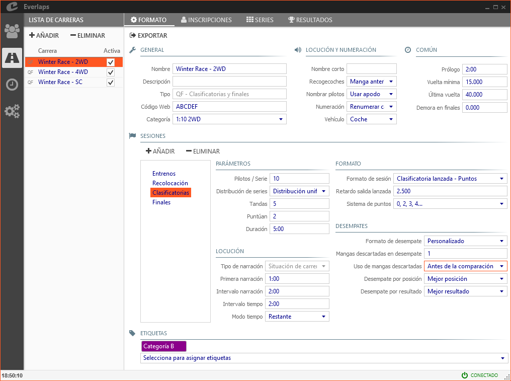
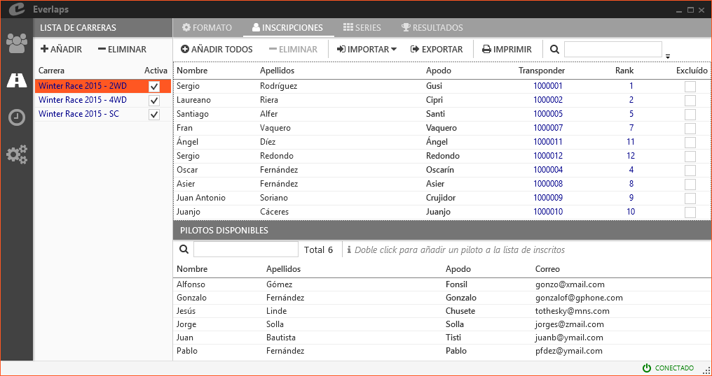
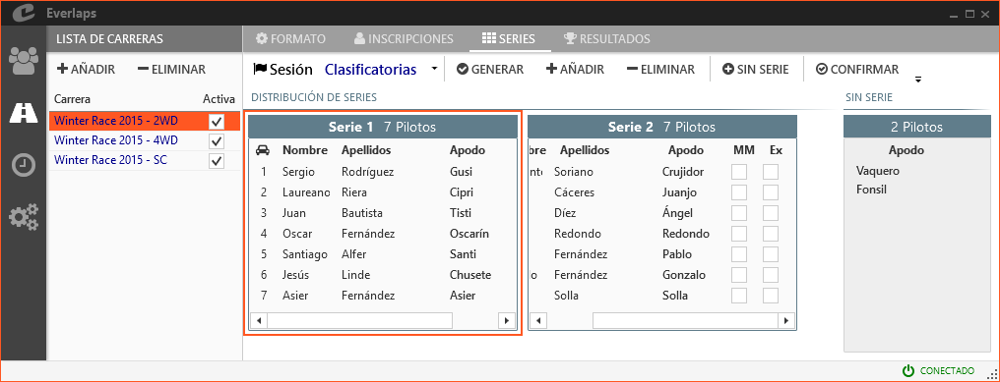
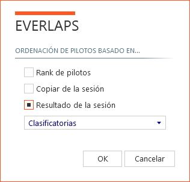

## &fa-road; Rennen

Hier werden die Rennen verwaltet die Einstellungen dafür festgelegt.

---

### Rennliste

Zeigt die Liste der aktuell verfügbaren Rennen an.

##### verfügbare Funktionen

- **Hinzufügen**: fügt ein neues Rennen entsprechend der Auswahl des Rennformates aus folgenden Möglichkeiten aus:
	- **Vorläufe und Finale**: erstellt ein Rennen aus [Vorläufen und Finals](../race-formats/qualify-finals/index.html)
	- **Vorläufe, Halfinale und Finale**: erstellt ein Rennen im [Aufsteigersystem](../race-formats/christmas-tree/index.html)
	- **Freies Training**: erstellt im Rennen ein [Freies Training](../race-formats/free-practice/index.html)
	- **aus Datei laden**: erstellt ein Rennen aus einer zuvor exportierten Rennkonfiguration.

- **Löschen**: löscht alle Daten des gewählten Rennens inklusive Nennung, Läufen und Ergebnissen.

##### Rennen Eingabefelder

- **Rennen**: Titel für das Rennen, wird in der Zuordnung der Läufe und oben auf den Listen ausgegeben

- **aktiv**: Zeigt ob das Rennen aktiviert ist. Aktive Läufe werden angezeigt in der [Laufliste](./heats/index.html#mangas_1) Über den AutoModus kann der zeitliche Rennablauf automatisiert werden.

---

### &fa-gear; Format

##### verfügbare Funktionen

- **exportieren**: exportiert eine Rennkonfiguration um damit später verschiedene Rennen mit gleicher Konfiguration erstellen zu können.

Die weitere Rennkonfiguration hängt vom Typ Format des gewählten Rennens ab - siehe bei den möglichen Formaten: 

- **[Vorläufe und Finale](../race-formats/qualify-finals/index.html)**
- **[Aufsteiger](../race-formats/christmas-tree/index.html)**
- **[Freies Training](../race-formats/free-practice/index.html)**

---

### &fa-user; Nennungen

Das Nennmanagement (ausser für [Freies Training](../race-formats/free-practice/index.html) dort werden die Fahrer automatisch regisriert sobald sie die Meßschleife erstmals passieren - vorausgesetzt sie sind in der Datenbank eingepflegt).

Der Bildschirm ist horizontal zweigeteilt:

- Der *obere* Teil beinhaltet die im Rennen genannten Fahrer.
- Der *untere* Teil ist die *Liste verfügbarer Fahrer* und zeigt die in der Datenbank gespeicherten Fahrer die noch nicht im Rennen genannt sind.

##### Funktionen

- **Alle Hinzufügen**: fügt alle aus der Datenbank verfügbaren Fahrer in die Nennliste ein.

- **Löschen**: löscht alle gewählten Fahrer aus der Nennliste (diese werden in die Liste verfügbarer Fahrer zurückgestuft).

- **Importieren**: 
	- **aus einer lokalen Datei**: läde die Nennliste aus einer über die [Everlaps-Website](http://everlaps.com) heruntergeladenen Nennliste.
	- **aus dem Internet**: läde die Nennliste direkt von der Everlaps-Website, sofern das [Rennpasswort](../race-formats/qualify-finals/index.html#campos-de-formato) gesetzt ist.
	
	!!! beachte ""
		Werden Fahrer importiert die zuvor schon lokal genannt waren, werden diese nicht überschrieben - Transponder und Rang bleiben erhalten, nur zuvor nicht genannte werden importiert.
	
- **Exporieren**: exportiert die Nennliste in eine Textdatei.

- **Drucken**: Druckt die Nennliste mit Fahrern und Transpondernummern.

- **Werkzeuge**:
	- **Rang zu Fahrzeugnummer**: Kopiert den Rang auf die Fahrzeugnummer.
	- **Fahrzeugnummer zu Rang**: Kopiert die Fahrzeugnummer zum Rang.
	- **Aufeinanderfolgende Fahrzeugnummern**: Nummeriert die Liste der Fahrzeuge entsprechend der Rangordnung beginnend mit 1 neu.

- &fa-search; **(Suche)**: Führt eine Suche unter den genannten Fahrern durch, deren Datenfelder (Name, Nachname, Kurzname, usw.) ganz oder teilweise mit dem im Suchfeld eingegebenen Text übereinstimmen.

##### Felder

- **Name, Nachname und Kurzname**: Diese Werte werden direkt aus der Datenbank kopiert über das Menue [Fahrer](./drivers/index.html). Änderungen werden in allen Rennen übernommen, in denen der Fahrer genannt ist.

- **Transponder und Rang**: Änderungen dieser Felder wirken sich nur auf das betreffende Rennen aus. Wenn der Transponder geändert wird, erscheint ein Dialog in dem die Erlaubnis zum Ändern des Stardardtransponders für künftige Rennen des Fahrers abgefragt wird. Wenn sich der Fahrer zudem einem aktiven Lauf angehört, wird die Erlaubnis zum HotSwap (heißer Tausch) abgefragt. Siehe [Transponder ändern](../common-tasks/change-transponders/index.html) für weitere Informationen.

- **Ausgeschlossen**: Der bestrafte Fahrer wird als letzter in allen Rennergebnissen gesetzt. Der ausgeschlossene Fahrer wird nicht länger beim automatischen generieren neuer Gruppen berücksichtigt. Siehe [Bestrafungen und Korrekturen](../common-tasks/punishments-corrections/index.html) für weitere Informationen.

#### verfügbare Fahrer

die *Liste verfügbarer Fahrer* zeigt die in der Datenbank gespeicherten Fahrer die noch nicht im Rennen genannt sind.

##### Aktionen

- &fa-search; **(Suche)**: Führt eine Suche unter den nicht genannten Fahrern durch, deren Datenfelder (Name, Nachname, Kurzname, usw.) ganz oder teilweise mit dem im Suchfeld eingegebenen Text übereinstimmen.

---

### &fa-th; Gruppen

Der Bildschirm in diesem Bereich ist zweigeteilt:

 - auf der rechten Seite die *Gruppeneinteilung*, enthält die Liste der Gruppen für die ausgewählte Session und Ihre jeweiligen Fahrer
 - auf der linken Seite die Liste der *Fahrer ohne Gruppeneinteilung*, enthält die Liste der Fahrer die in der ausgewählte Session noch keiner Gruppe zugeordnet wurden.
 
##### Aktionen

- **Session**: Wählt die Session aus für die die Gruppen gezeigt werden sollen.

- **Generieren**: Automatisches Generieren der Gruppen mit der Anzahl der Fahrer pro Gruppe wie in der Konfiguration der Session angegeben, je nach den im folgenden Dialog ausgewählten Parametern etweder nach Rangordnung oder basierend auf den Ergebnissen der vorherigen Sitzungen.
	
	

	- **Fahrer Rang**: Die Fahrerreihenfolge wird durch das Ranking definiert.
	- **Kopiere Von Session**: Die Fahrerverteilung wird genauso wie unten in der Liste ausgewählten Session definiert.
	- **Session Ergebnis**: Die Fahrerreihenfolge wird aus dem Ergebnis der unten in der Liste ausgewählten Session definiert.

		!!! beachte ""
			Beim Generieren von Läufen auf Basis von Ergebnissen einer vorherigen Sitzung werden ausgeschlossene Fahrer ignoriert.

- **Hinzufügen**: Fügt eine leere Gruppe hinzu.

- **Löschen**: Löscht die gewählte Gruppe. Die Fahrer in dieser Gruppe werden zu den *Fahrern ohne Gruppe* zurückgestuft. 

- **ohne Gruppe**: fügt alle *Fahrer ohne Gruppe* der letzten Gruppe hinzu.

- **Bestätigen**: Erzeugt die Läufe entsprechend der Gruppenverteilung aus der Konfiguration.

	!!! beachte ""
	Das Programm ist so flexibel, dass nach dem ersten Erstellen der Läufe noch neue Gruppen hinzugefügt werden können. Durch das anschliessende * bestätigen * werden die zusätzlichen Läufe erstellt. Es ist auch möglich, Fahrer nach dem Bestätigen zu von Gruppe zu Gruppe zu bewegen sofern noch kein betreffender Lauf gestartet wurde.

- **Drucken**: Druckt die Liste der Gruppen mit den zugehörigen Fahrern.

- **Werkzeuge**:
	- **Gruppen neu ordnen**: erlaubt das manuelle Neurordnen der Gruppen in der Laufreihenfolge.

#### Gruppeneinteilung

Die Fahrer können per drag & drop von einer Gruppe in eine andere umverteilt werden.

##### Felder

- **Name, Nachname und Kurzname**: Diese Felder entsprechen denen der Datenbank.

- **Bester Lauf**: erlaubt es dass ein Fahrer mit dem *Verlust des besten Laufes* bestraft werden kann. Siehe [Bestrafungen und Korrekturen](../common-tasks/punishments-corrections/index.html) für weitere Informationen.

- **Ausgeschlossen**: Der bestrafte Fahrer wird als letzter in allen Rennergebnissen gesetzt. Der ausgeschlossene Fahrer wird nicht länger beim automatischen generieren neuer Gruppen berücksichtigt. Siehe [Bestrafungen und Korrekturen](../common-tasks/punishments-corrections/index.html) für weitere Informationen.

#### Fahrer ohne Gruppen

Alle genannten Fahrer die im Rennen noch keiner Gruppe zugeordnet sind, werden auf der rechten Seite des Bildschirms angezeigt. Die Fahrer dieser Liste können nach Bedarf in die Gruppen gezogen werden.

!!! beachte ""
	Wenn die Gruppen einmal generiert wurden, können Nachnennungen per drag & drop aus den *Fahrer ohne Gruppe* in die bestehenden Gruppen zugeordnet werden, werden zusätzliche Gruppen erzeugt müssen sie diese *Bestätigen* 
	
	Es ist nicht erforderlich bestehende Gruppen neu zu generieren
	
---

### &fa-trophy; Ergebnisse

Zeigt die Ergebnisste der gewählten Session mit den Details der von jeden Fahrer zurückgelegten Runden, ausserdem werden Gleichstände, Korrekturen und Strafen der Session ausgegeben.

##### Funktionen

- **Sitzung**: Wählt die Session für die die Ergebnisse ausgegeben werden sollten.

- **Neu Berechnen**: Aktualisiert das Ergebniss der Session sofern der aktuelle Lauf Einfluss darauf hat.

- **Drucken**: Druckt die Ergebnisse der gewählten Session.

