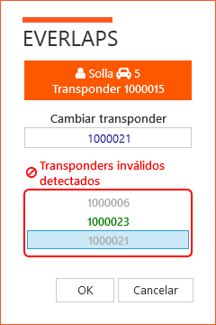

## &fa-bolt; Change transponders

When changing a drivers transponder, it is important to understand  how everlaps manages transponder assignments.

### Transponder in the drivers list (transponders and rankings)

On the one hand, in the [drivers list](../user-guide/drivers/index.html), The transponders belonging to a driver are established. These values are used to facilitate assigning and changing transponder in the registrations list. **Modify a transponder in the drivers list has no bearing on the drivers actual registrations** (except in [free practice](../race-formats/free-practice/index.html) mode, since every time a crossing is made the transponders belonging to each driver are verified).

### Transponder in the race registration list

The transponder assigned to a driver in a race, is independent from the number assigned in the drivers list and other races. 

A transponder can be changed quickly by selecting in the list of transponder belonging to a driver, or a new transponder number can be introduced manually (In which case it will be added automatically to the list of transponders belonging to a driver in the class of the race). 

If the change is made to a registration belonging to an active heat, a dialogue will be shown asking to confirm the *on the fly* change. 

When a race registration list is imported  from the Everlaps web site (where previously all the participants have registered for the race indicating their transponder number) The numbers assigned to the drivers for this race are those that they have introduced when registering.

## Changing a transponder on the fly

To change a drivers transponder number, as has been explained in the previous section, ideally it is done in [registrations list](../user-guide/races/index.html#inscripciones) of that race. 

Nevertheless another way exits if the heat has been activated. In the view [active heat situation](../user-guide/heats/index.html#situacion-de-la-manga-activa), where the list of drivers participating in the active heat appears, it is possible to show the dialogue *Change transponder* using the right mouse button on the driver whose transponder will be modified.

The dialogue shows the name and vehicle number of the selected driver, as well as the actual transponder, being able to introduce the new transponder number. 

If the driver has already **made a crossing** of the finishing line since the heat activation, in the lower part of the dialogue will show the transponders that have already made a crossing and does not belong to any driver in the active heat, it is possible to select any transponder in the list and assign it to a driver. The list of invalid transponders appear in grey, except the last transponder to have passed the finishing line, which appears in green. This way it is easier to identify to whom the invalid transponder number belongs to.

!!! note ""
	During the heat prologue (from activation until start) the drivers whom have made at least one crossing of the finishing line are marked with a &fa-check; in the view [situation of active heat](../user-guide/heats/index.html#situacion-de-la-manga-activa), indicating that the driver is on the track. 
	
	It there are drivers with the incorrect transponder, it will be those that *do not* have the green &fa-check;.

