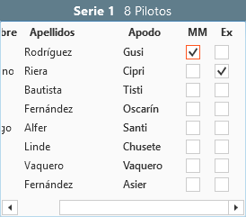
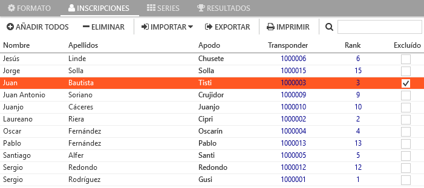

## &fa-legal; Penalties and corrections

---

There are various types of penalties and corrections, and each needs to be applied in the appropriate section of the program.

!!! note "Frequent penalties quick view"
	- Penalties/Corrections **specific heat**: See [heat level penalties](#sanciones-a-nivel-de-manga)
	- Penalty **Best heat**: See [Session level penalties](#sanciones-a-nivel-de-sesion)

---

#### Heat level penalties

These are performed in the section [laps](../user-guide/heats.md#vueltas), where all the drivers laps lists appear, and a section beneath where corrections are applied. There are two types according to the heats state:

##### In-Race

Allows making corrections to the total number of laps for a driver while the heat is underway. This option is normally used when a passing is made that is not detected by the decoder.

##### Post-Race

Allows making corrections once a heat has finished. The options are:

- **Laps**: Allows adding or removing a drivers laps. The laps modified in the In-Race section appear here automatically once the heat finishes.

- **Time**: Allows adding or removing total time to a drivers heat.

- **Penalised**: Penalises a heat with its loss for that driver. 
	
	*When penalising a specific heat (generally the penalty is applied to the heat that has just finished), The drivers that finished behind the penalised driver advance in position.*

All penalties have a immediate effect and the result can be seen in the results section of the program (session, round or heat) or by printing any of the results. Penalties will appear as foot notes on the printed results.

---

#### Session level penalties

These are made in the series section, for the corresponding session. On the right of the drivers list, are the following options:

- **Best Heat**: Penalises the driver with the loss of best heat of the session. As the drivers best heat is not known until all the rounds are concluded, as the race results are generated, the best heat is selected from the results list for that session, and that is the one that is docked. 

	*As the best heat can vary as the session advances, The drivers that are placed behind the penalised driver do not advance in the results list. In case that the advancement is required, it will be necessary to wait to the end of the session and penalise the best heat directly *(heat level penalties).*

- **Excluded**: Places the driver in last place for the session and will be excluded from automatic generation of new series.

---

#### Race level penalties

These are made from the registration section of the program. A single option exists:

- **Excluded**: Places a driver in last place in all sessions participated in and will be excluded from automatic generation of new series.

