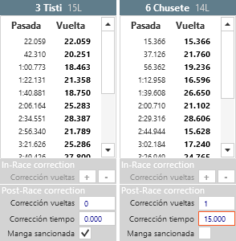

## &fa-legal; Penalties and corrections

---

Various types of penalties and corrections, and each needs to be applied in the appropriate section of the program.

!!! note "Frequent penalties quick view"
	- Penalties/Corrections **specific heat**: See [heat level penalties](#sanciones-a-nivel-de-manga)
	- Penalty **Best heat**: See [Session level penalties](#sanciones-a-nivel-de-sesion)

---

#### Heat level penalties

These are performed in the section [laps](../user-guide/heats/index.html#vueltas), where all the drivers laps lists appear and a section beneath where corrections are applied. There are two types according to the heats state:

##### In-Race

Allows making corrections to the total number of laps for a driver while the heat is underway. This option is normally used when a crossing is made that is not detected by the decoder.

##### Post-Race

Allows making corrections once a heat has finished. The options are:

- **Laps**: Allows adding or removing a drivers laps. The laps modified in the In-Race section appear here automatically once the heat finishes.

- **Time**: Allows adding or removing total time to a drivers heat.

- **Penalised**: Penalises a heat with its loss for that driver. 
	
	*When penalising a specific heat (generally the penalty is applied to the heat that has just finished), The drivers that finished behind the penalised driver advance in position.*

All penalties have a immediate effect and the result can be seen in the results section of the program (session, round or heat) or by printing any of the results. Penalties will appear as foot notes on the printed results.

---

#### Sanciones a nivel de sesión

Se realizan desde la sección de series, para la sesión correspondiente. En la parte derecha de la lista de pilotos, existen las siguientes opciones:

- **Mejor Manga**: Sanciona al piloto con la pérdida de la mejor manga en esa sesión. Como la mejor manga del piloto no se conoce hasta que han concluido todas las tandas, según se van generando los resultados de carrera, se va seleccionando la mejor en el listado de resultados de la sesión, y esa es la que se deshecha. 

	*Como la mejor manga puede ir variando según avanza la sesión, no se produce ascensión de posición de los pilotos que están situados por debajo del piloto sancionado. En caso de querer que sí se produzca la ascensión, habría que esperar al final de sesión y sancionar la mejor manga de forma directa (sanción a nivel de manga).*

- **Excluído**: Sitúa al piloto en último lugar para esa sesión y evita que participe en la generación automática de nuevas series.

---

#### Sanciones a nivel de carrera

Se realizan desde la sección de inscripciones del programa. Existe una única opción:

- **Excluído**: Sitúa al piloto en último lugar en todas las sesiones en las que participe y evita que participe en la generación automática de nuevas series.

