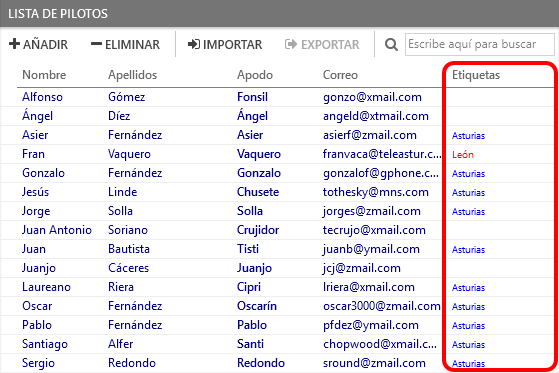
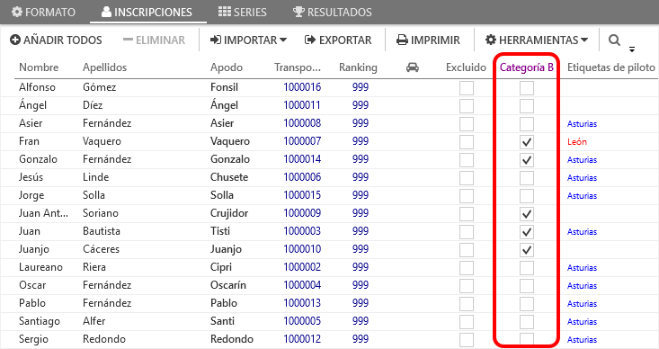

## &fa-tag; Tags

Everlaps allows the creation of personalised tags that can be assigned to drivers and races

---

### Tags assigned to drivers

The tags assigned to drivers allows finding a driver easily introducing the name of the tag in the search fields of [drivers](../user-guide/drivers.md), [registrations](../user-guide/races.md#inscripciones) or [series](../user-guide/races.md#series).

Some examples of the use of tags to identify drivers could be:

 * Members: Allows locating club members among those registered for the race
 * Counties: In initial sessions drivers from the same county could be grouped together in series
 * Categories: If the final result has any distinction as far as categories are concerned (junior, +40, etc...) these drivers can be grouped in the same series

 ---
 
### Tags assigned to races (registrations)

when tags are assigned to a [race](../race-formats/qualify-finals.md#etiquetas), a new column appears in the [registrations](../user-guide/races.md#inscripciones) view, that permits assigning the corresponding tag to each driver, in such a way that during the race independent results can be generated by filtering the tags.

This system allows easily introducing a race category that deviates into a different final to the main final. 

Example:

 * In the race a *Category B* is introduced for beginners. All the drivers participate in qualifying together, but when changing to finals (or sub-finals) it is required that *Category B* drivers run an independent final (in a new session belonging to the same race). when generating the series of that final, filtering can be performed by the *Category B* tag, so that automatic generation of series based on the qualifying results, only takes into account those drivers of that category.

!!! note ""
	When a tag is assigned to a race and a driver has that tag assigned, That tag is automatically marked in the corresponding column in the drivers registration.
