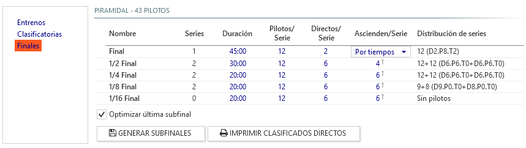

## Christmas tree format

The christmas tree format is characterised by establishing a series of sub-finals in the form of a pyramid or *christmas tree* that permits any driver that rises from the lower finals to reach the absolute final, even if qualifying in last place during the qualifying session. 

The sessions previous to the finals (practice, re-ordering and or qualifying) maintain the same format defined in [qualifying and finals](./qualify-finals.md), therefore in this section explains is exclusive to the workings of christmas tree format (sub-finales).

### Configuration of sub-finals and final

!!! note ""
	The number of drivers used to calculate the distribution of the sub-finals is that of the registration list, except those drivers excluded from the race or qualifying session. This is useful to fine tune the distribution in case there are drivers that are registered but are not going to race, or have abandoned after qualifying.

- **Name**: Defines the sub-final or final. It is established automatically.

- **Series**: Number of series involved in the sub-finals, calculated automatically. Each sub-final always has two series, except:

	- The final, always contains only one series.
	- The last sub-final, if the number of drivers is equal to or lower than the number of *Drivers/Series* and the option *Optimise last sub-final*is enabled, it is integrated into an only series.

- **Duration**: Duration of each heat of sub-final or final.

- **Drivers/Series**: Maximum number of drivers in each series of sub-final or final.

- **Direct/Series**: Number of drivers whom pass straight to each sub-final or final depending on qualifying results. In the example above, the first two qualified pass straight into the final.

- **Promotion/Series**: Number of drivers whom promote to the next sub-final depending on result of actual sub-final. 

	*In the above example, from the semi-final to the final 4 drivers per series promote (8 in total: The first 4 from semi-final A and the first 4 from semi-final B).*

	The final is treated differently since it is the last level of the christmas tree and it makes no sense to promote further. In this case selecting how the final starting grid will be generated for the drivers that have promoted from the sub-finals.

	- **By time**: All drivers from series A and B are ordered by their *Laps/Time* obtained in semi-finals and are added to the starting grid after those with direct access.
	- **Interspersed**: Drivers are added interspersed from both series: first place series A, first place series B, second place series A, second place series B, etc...

	!!! note ""
		In the case that the sum of drivers with direct access plus those promoted by position do not complete the total of drivers per series, The drivers necessary are promoted to complete the final/s according to results of *Laps/Time*.

- **Driver distribution**: Shows a summary of the composition of the sub-finals according to the drivers registered in the race to verify that the data introduced generates the desired distribution.

	- **Number + number**: drivers that participate in each series.
	- **D**: Number of drivers that qualify with direct access from their qualifying results.
	- **P**: Number of drivers that promote from the previous sub-final according to position. 
	- **T**: Number of drivers that promote from the previous sub-final according to results of *Laps/Time*.
	
##### Additional Actions

- **Generate Sub-finals**: Initialises or refreshes the list of sub-finals according to the configuration parameters introduced and the number of drivers registered in the race.

- **Print direst access**: Once the qualifying heats are finalised, it allows the generation of the list of drivers with direct access to corresponding sub-finals.

!!! warning "Generate Sub-finals"
	After modifications are made to any of the configuration parameters of the christmas tree which causes the number of sub-finals, it will be necessary to click *Generate Sub-finals* so that the list of sub-finals in the race is refreshed.

	Until *Generate Sub-finals* is pressed at least once the list of sub-finals will not be generated so that the series are generated correctly in the panel [series](../user-guide/races.md#series)
