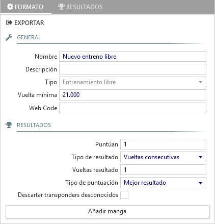

## Free practice 

The free practice format works differently from the other race formats, that requires registering participating drivers previously to generate series in which to group them.

In free practice there is a single session and series where all the drivers that enter the track participates in one or various heats.

##### General

- **Name**: descriptive title for the round of free practice.

- **Description**: Text that appears at the top of reports.

- **Type**: Identifies the race format. In this case it will show *Free practice*.

- **Minimum lap time**: Minimum lap time for the track. Laps inferior to this will be considered a short cut and will not be counted.

- **Web Code**: Necessary to publish times live on [Everlaps](http://everlaps.com) web site.

##### Results

- **Points scoring**: Number of heats that will be used to obtain final results for each driver.

- **Type of result/Laps result**: Identifies how to establish heat results. See [qualifying and finals](./qualify-finals.md) for more details.

- **Type of scoring**: Identifies how to establish the general results of practice. See [qualifying and finals](./qualify-finals.md) for more details.

- **Discard unknown transponders**: If enabled, passings made by transponders not in the database are ignored.

!!! note ""
	Having various free practice heats is useful because it allows re-setting all the drivers records and starting from zero. A common case is a driver short cutting and getting absolute record for the heat, which means until another is started this value is maintained.

When a free practice heat is started, The announcement system will narrate the drivers whom are on the tracks lap times, emphasizing personal bests and fastest lap for the heat. At any moment, the heat results up until that point may be printed and a list of fastest laps for each driver.

If a drivers transponder is not registered the laps will be shown while the heat is active as the name *Car* along with the last 3 digits of the transponders of those drivers and their times will be announced, but the laps will not be saved in the database.

During free practice heats, nick names and transponder numbers can be modified directly in the [Drivers list](../user-guide/drivers.md) and the changes will take place immediately.

!!! note ""
	When a free practice heat is finalised manually the results are not printed, even if the option *print automatically at the end of each heat* is enabled.

