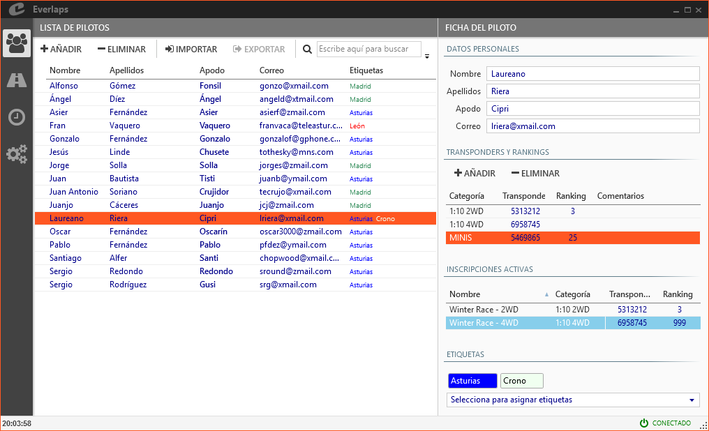

## &fa-users; Drivers

Permits you to manage all the drivers available in the programs database.

Glossary of terms used to manage the driver:

- **Driver**: An Individual that will be taking part in any of the configured races
- **Category**: The different classes according to vehicle category
- **Transponder**: Personal transponder number used by the lap counting system to identify a driver
- **Ranking**: Driver ability in relationship to each other
- **Tag**: Allows you to group drivers with a common identifier    

A driver can have assigned different transponder or ranking according to the classes that will be raced in, also any tag number defined in the program.

---

### Drivers list

Permits input, modification or deleting of the available drivers.

##### Actions

- **Add**: Inserts a new line in drivers list ready to be filled out with driver data.

- **Remove**: Removes selected drivers from the data base. 

- **Import**: loads a list of drivers from a file.

- **Export**: copies a list of drivers to a file.

- &fa-search; **(Search)**: Performs a search upon the drivers visible, showing matches or partial matches (name, surname, transponder, category, tags etc...)  to the text input in the search field.

##### Fields

- **Name and Surname**: Will appear in the list to positively identify the driver.

- **Nick name**: Nick names will be used by the voice announcements to narrate times and position of the drivers, as on the detailed race reports. There can be duplicate Nick names in the data base, but they are no allowed in the same Heat (The program will issue a warning so that they can be modified).

- **email**: The email address is the means by which the program identifies the drivers between the local database and the one available on the internet [Everlaps web site](http://everlaps.com), so that race registration and results can be managed for each driver bidirectionally.

	When drivers are manually added, it is important to add the email address correctly in case they are already registered on [Everlaps](http://everlaps.com) so that the results are assigned correctly.

- **Tags**: Shows all the tags assigned to a driver.

---
	
### Driver data

Shows all the information about a driver, including besides personal data mentioned earlier, lists of transponders and rankings per category, active races  the driver is participating in, and any tags assigned.

#### Transponders, rankings and vehicle numbers

Manage the drivers list of transponders, rankings and vehicle numbers according to the categories that are being participated in.

- **Categories**: Permite seleccionar entre las disponibles en la lista de [categorías](./config/index.html#categorias)
- **Transponder, rank y vehículo**: Permite asignar los valores correspondientes para el piloto en la categoría seleccionada.

!!! note ""
	Al inscribir un piloto manualmente en una carrera, el sistema compara la categoría de la carrera con las categorías asignadas al piloto para asignar el transponder correspondiente. En caso de que no exista coincidencia, se asigna el transponder asignado a la categoría por defecto. 

#### Inscripciones activas

Lista de las carreras marcadas como activas en las cuales participa el usuario seleccionado.

Es posible modificar el transponder y rank de la inscripción seleccionada desde aquí, de la misma forma que se haría en la sección de [inscripciones](./races/index.html#inscripciones).

#### Etiquetas

Muestra las etiquetas asignadas al usuario.

Las etiquetas permiten filtrar y agrupar de forma rápida a los pilotos en las distintas secciones (lista de pilotos, inscripciones, series...).

Se puede asignar cualquier etiqueta seleccionándola del desplegable inferior, y se puede eliminar haciendo clic sobre la *X* que aparece al situar el cursor del ratón sobre la etiqueta que se desea eliminar. La lista completa está definida en la sección de configuración de [etiquetas](./config/index.html#etiquetas).

