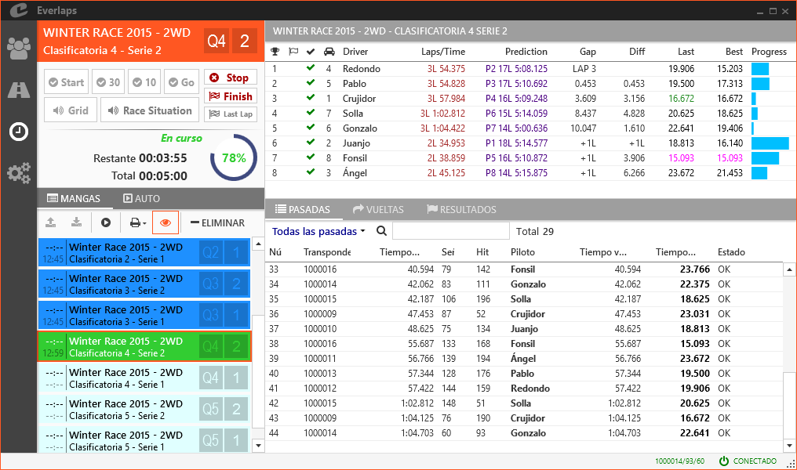
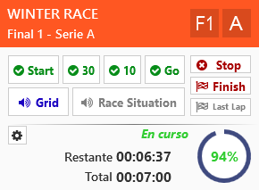
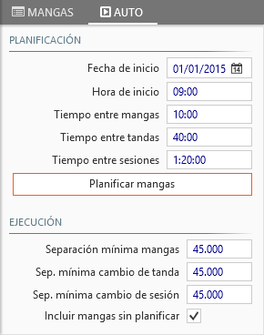
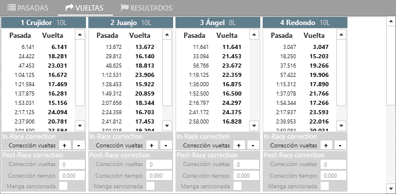
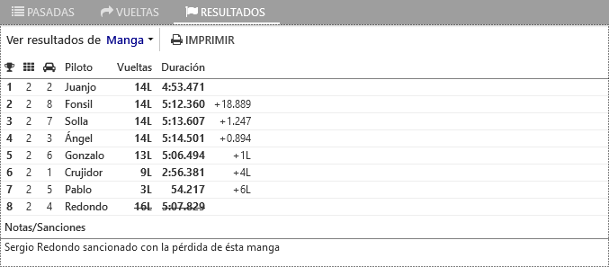

# :fontawesome-regular-clock: Heats

Heats progress is controlled from here, heats will be activated in the order established by the timekeeper, and generating the corresponding results sheets.

---

### Controlling the active heat

Once the heat is activated, the heat can be controlled from the panel.

##### Actions

- **Start**: Starts the heat with the prologue time established in [*prologue*](../race-formats/qualify-finals.md#campos-de-formato), In the race options. A warning will be given every minute of time left,name of heat, drivers and marshals. The last warnings will be at 30, 20 and 10 seconds before start.

- **30/10**: Starts the heat with a 30 or 10 second prologue time.

- **Go**: Immediate start.

- **Grid**: When the heat is active but has not started, this forces announcement of name of heat, drivers and Marshals.

- **Stop**: Stops a running heat. The heats results will are frozen at the moment of the halt.

- **Finish**: Stops and finalizes a running heat. The heats results are frozen and the announcement system reports end of heat and its results, The heat become in-active and if automatic results printing is configured the corresponding data is sent to the printer.

	!!! note
		After the end of heat sound, the program waits the pre-configured *Last lap* time, until all drivers that have passed the finishing line at least once finish their last lap. If a driver breaks and abandons the heat, the program will keep waiting for this driver until the *Last lap* time is up. In this case the *Finish* button is useful to terminate a heat without altering the results and saving time waiting for a car no longer on the track.

- :fontawesome-solid-gear: (*Heat parameters*): Shows the actual parameters of the active heat (duration, minimum lap time, last lap time, etc...)

!!! warning "Modifying an active heat"
	When a heat is activated, a safe copy of the heat data is made, transponder numbers, driver names, duration, format, etc... to guarantee the integrity of the program from possible erroneous modifications during the course of the heat. 
	
	To modify any of the drivers configuration values, heats to which they belong, race or session (Nick name, duration, standby time etc...) It will be necessary to deactivate the active heat, and re-activate it so that the new values are applied, except for the following data which can be **changed on the fly** even when the heat is active:
	
	- **Transponder**: Can be modified in the race registration list, or from the [Active heat situation](#situacion-de-la-manga-activa) panel, right clicking and using the change transponder option.
	- **Minimum lap time**: Can be changed at any time.
	- **Last lap time**: Can be changed before the heat has entered *last lap* time.
		
	NOTE: In [free practice](../race-formats/free-practice.md) it is possible to add new drivers on the fly, and modify nick names since this session format can access the database directly.

---

### :fontawesome-solid-rectangle-list: Heats

##### Actions

- :fontawesome-solid-upload: (*Activate selected heat*): Activates the selected heat, Showing the control panel and initialising the other panels *Heat situation* and *Results*. 

	!!! note
		If a heat that is activated already contains laps and results because it was started previously, a warning will be shown, and before the heat is re-started another warning will be shown, before **the saved data is deleted** completely.

- :fontawesome-solid-download: (*De-activate the selected heat*): De-activates the active heat if it is not in progress, in which case the heat will need to run its course or by pressing *Stop* or *Finish*

- :fontawesome-solid-circle-play: (*Activate/De-activate automatic mode*): Activates or de-activates [automatic mode](#auto). The icon can be in one of 3 states:
	
	- :fontawesome-solid-circle-play: (static): Automatic mode is disabled.
	
	- :fontawesome-solid-circle-play: (spinning): Automatic is enabled and in standby to start the next heat. Remaining time will be shown and announcements made every minute.
	
	- :fontawesome-solid-circle-play: (blinking): The heat is active and in automatic and waiting to finalise before next heat is  started after the pre-configured prologue time.
	
	!!! note
		With automatic enabled, if a user starts the heat manually, or stops the heat once it has been activated in automatic, it will need to be re-started **manually**. Automatic mode will continue once the active heat finishes or is de-activated manually.

- :fontawesome-solid-eye: (*Show/Hide finalised heats*): Shows or hides finalised active heats.
		
- :fontawesome-solid-print: (*Print results*): Prints the results which correspond to the selected heat.

	!!! note
		It is possible to print heat, round or session, even in the middle of a heat. The results shown will correspond with the heat results up until that moment.
	
	- **Race**: Generates report for selected heat.
	
	- **Round**: Generates report for the round to which the selected heat belongs, including all the heats which belong to that round.
	
	- **Session**: Generates report for the session, to which the selected heat belongs, including all the rounds from the first up until the round that the heat belongs to.

- **Delete**: Removes the selected heat, including all laps and results.

##### Contextual menu

Right clicking on any heat except the active heat will access the contextual menu, with the following options:

- **Modify state...**
	- **To be started**: Heats waiting to be started, even if they may have results registered, are not included in the session results.
	- **Finished**: Finished heats, The heat will be included in session results. Even if they have no results can be marked as finished, which will allow heats from the next round to be activated if necessary.
- **Generate empty lap boxes**: Generates boxes in the lap counting panel that allow result corrections to be made for the drivers in that heat. It is useful when results need to be input without running the heat, or if drivers are added to a heat after the heat has been run, and manual results need to be established for laps and time. 

---

### :fontawesome-regular-square-caret-right: Auto

Controls automatic launching of heats for the active race meeting.

#### Scheduling

Enables scheduling of the heats according to the following parameters:

- **Start date**: Configure the start date for the race meeting. Useful if the race meeting is scheduled a few days in advance.

- **Start time**: Start time of the first heat.

- **Time between heats**: Start time between consecutive heats. 

	*For example, a 7 minute final, with a 2 minute  prologue and a  30 second last lap time has a minimum duration of 9.5 minutes. Taking into account the time drivers need to access the rostrum, an adequate time between heats could be almost 11 o 12 minutes.*

- **Time between rounds**: Time between the start of heat belonging to the same series but belonging to consecutive rounds. 

	*For example, assuring that each series has 40 minute between heats so that batteries can be correctly charged, this is the value that should be specified. The system will use it as the minimum value, although depending on the number of heats and the time between them, the scheduled time could be greater.*

- **Time between sessions**: Time between the start of different sessions. 

	*For example, it can be useful for establishing the minimum separation between the session of controlled practice and the session of re-ordering.*

- **Scheduling heats**:Executes the scheduling of the remaining heats according to the established parameters.

#### Execution

The execution parameters are applied just before launching the next heat and allows controlling, in the case that the original schedule suffers delays, how time is made up to follow the original schedule. 

- **Minimum separation between heats**: Minimum time between the end of one heat and the launching of the next. 

	*Keeping in mind that the outgoing drivers need to abandon the rostrum, and those of the next heat need to access it, an adequate value could be between 1 or 2 minutes.*

- **Minimum separation between rounds**: Minimum time between the end of one heat and the launching of the next, when the heats belong to different rounds. 

- **Minimum separation between sessions**: Minimum time between the end of one heat and the launching of the next, when the heats belong to different sessions.

- **Include heats not scheduled**: If selected, when launched in automatic mode heats not previously scheduled will be included, only *Execution* values between them are upheld. It also enables launching automatic mode directly **without scheduling any heats**.

---

### Situation of the active heat

This panel shows the actual state of the running heat, and maintains the result until the next heat is activated.

The fields always maintain their names in english so that they coincide exactly the same as the visualization of the *Live Timing* in the web browser.

- :fontawesome-solid-trophy: (*Position*): Drivers race position in the heat.
- :fontawesome-regular-flag: (*Finalised*): If the flag appears :fontawesome-solid-flag-checkered: it means that the driver has finished the heat.
- :fontawesome-solid-check: (*Verified*): a green tick icon :fontawesome-solid-check: indicates that a driver has crossed the finish line during the heats prologue time. It is useful to verify, just before the start of the chrono, that all the drivers have an correctly assigned transponder.
- :fontawesome-solid-car: (*Vehicle number*): drivers vehicle number.
- **Driver**: Drivers nick name.
- **Laps/Time**: Drivers laps and time in any given moment.
- **Prediction**: In qualifying heats, it indicates a predictive result for laps and time by the end of the heat.
- **Gap**: Time difference in time or laps to the race leader.
- **Diff**: Time difference in time or laps to previous driver.
- **Last**: Drivers last lap time.
- **Best**: Drivers best lap time.
- **Progress**: Progress bar that approximately indicates drivers lap progress. When the bar is complete, the driver should be crossing the finish line if no incident has occurred.

!!! note "Transponder change on the fly"
	Right clicking on any driver in this panel, will show the change transponder dialogue. See [Cambio de transponder](../common-tasks/change-transponders.md) for more information.

---

### :fontawesome-solid-list: Crossings

Shows details of each drivers crossings in chronological order. In case a crossing is not accepted, it will be shown with a different state and colour. The possible states are:

- **OK**: Correct crossing and is counted in the heat.
- **Corrected**: The crossing is counted but the time has been corrected because the drivers chrono was previously started.
- **Prohibited**: The crossing of a transponder not belonging to any driver in the active heat.
- **Expired**: The crossing is out of last lap time and will not be counted.
- **short cut**: A short cut is detected (a lap time lower than is established in *minimum lap time*) and will not be counted.
- **Finalised**: A driver already finalised will not be counted when crossing the finish line.
- **Denied**: In relay races, if a driver does not have clearance to enter the track the crossing will be rejected.
- **Low signal**: The crossing did not pass the signal filter or hits established in the decoders configuration.
- **Start margin**: The crossing is not counted because the crossing has occurred in a final before end of *Finals start time*.

!!! note
	In the field lap time, the **orange colour** indicates that the lap time is double the minimum lap time established, which could indicate an uncounted lap for that driver for not having crossed the finishing line correctly.

##### Contextual menu

Once a heat finishes, it is possible to assign crossings or deny them using the right mouse button over the corresponding crossing.

- **Modify state...**: Modifying the state of a crossing will cause a re-calculation of the drivers lap times and results in the corresponding heat.
	- **OK**: The crossing is assigned to the driver whose transponder coincides with that of the crossing.
	- **Denied**: The selected lap is marked as denied and is not counted.
	
- **Assign all**: Assigns all laps marked as *prohibited* o *recuperated* to the drivers whose transponder coincides with the crossing.

- **Verify lap times**: Verifies that there are no *short cuts* or *out of time* counted as valid. 
	
	*This process occurs each time that a crossing state is modified or all of a drivers crossings are added.*

- **Decoder**: Allows the recovery of all crossings directly from AMB decoder *only if it is connected via Ethernet*.
	- **Recover lost crossings**: Analyses existing crossings and recovers those that could have been lost due to a communication error with the decoder.
	- **Recover last 10 crossings**: Recovers 10 existing crossing just after the last recorded crossing for the heat. This action can be repeated as many times as may be necessary.

---

### :fontawesome-solid-mail-forward: Laps

The laps screen shows the chronological order of the crossings for each driver. From here and once finalised and de-activated the heat, it is possible to make corrections on each drivers results. See [penalties and corrections](../common-tasks/punishments-corrections.md) for more information.

The laps can be sorted by lap time or chronological order, clicking with the mouse over the title of the corresponding column (*Crossing* or *Lap*).

!!! note
	As in the crossings panel, In the field lap time, the **orange colour** indicates that the lap time is double the minimum lap time established, could indicate an uncounted lap for that driver for not having crossed the finishing line correctly. 

---

### :fontawesome-solid-flag: Results

Shows the heat or round results for the selected heat. It is very useful in the case of applying corrections or penalisations for a driver, as it allows viewing the heat or round results before being printed.

- **View results of**:

	- **Heats**: Shows the results for the selected heat.
	- **Rounds**: Shows the results of the complete round for the selected heat.
	
- **Print**: prints the results for the heat or round that is being visualized.
