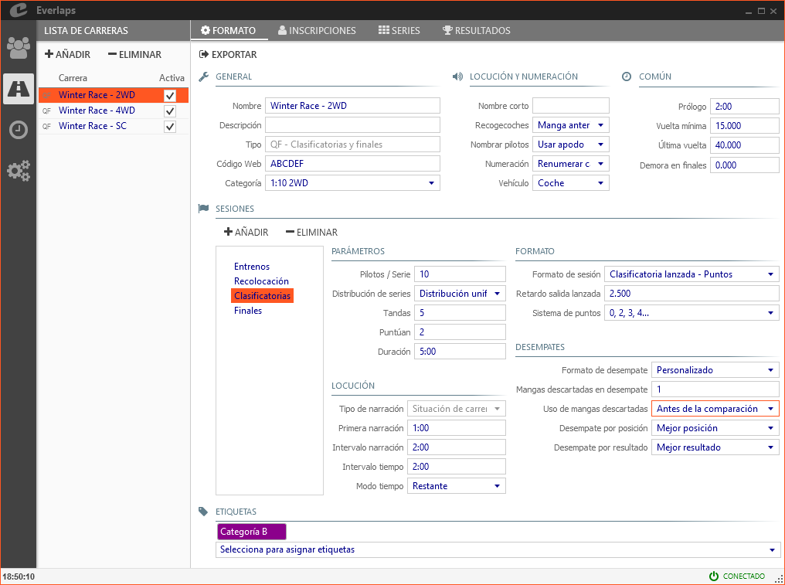
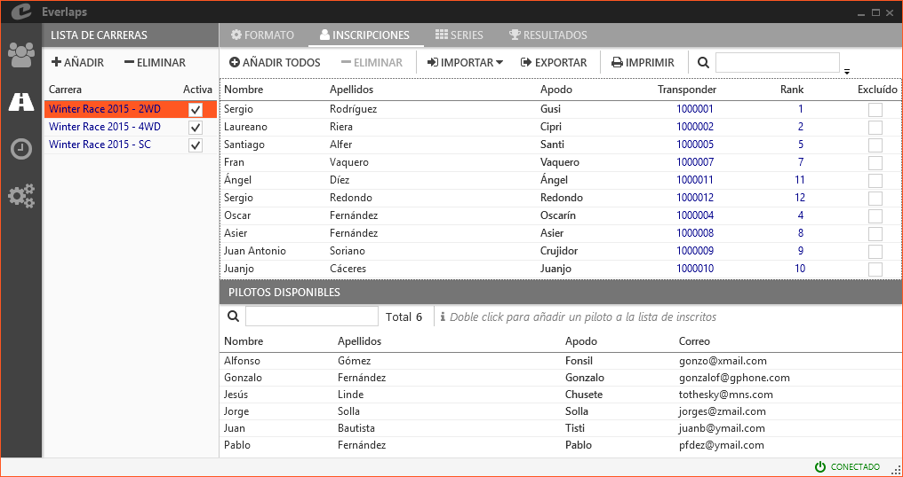
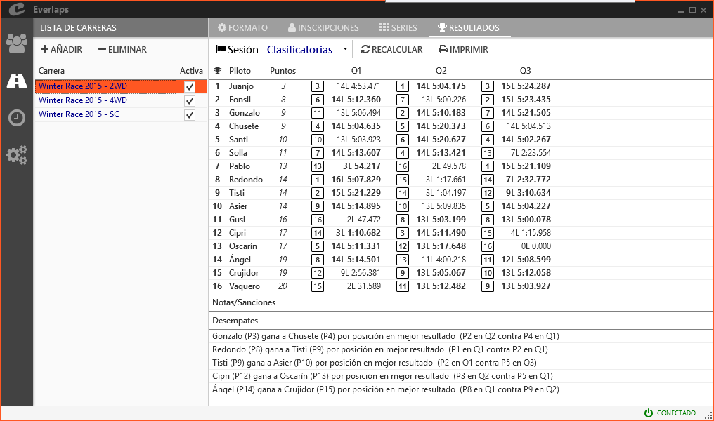

## &fa-road; Races

Here is where the available races are managed, and where the parameters are configured.

---

### List of races

Shows the list of races available at the moment.

##### Available Actions

- **Add**: Allows the creation of new races according to the format chosen among those available:
	- **Qualifying and Finals**: creates a race with a [qualifying and finals](../race-formats/qualify-finals/index.html) format.
	- **Qualifying, semis and finales**: creates a race with a [Christmas tree](../race-formats/christmas-tree/index.html) format.
	- **Free practice**: creates a race with a [free practice](../race-formats/free-practice/index.html) format.
	- **Load from file**: Allows the creation of a race from a file generated by exporting the configuration of a previous race.

- **Remove**: Deletes all the data from the selected race, including registrations, heats and results.

##### Race fields

- **Race**: Name identifying a race. It will be used on the heat lists and on all the race reports.

- **Active**: Shows if a race is active at the moment. For active races heats are shown in [heats lists](./heats/index.html#mangas_1) scheduling can be performed from the automatic mode.

---

### &fa-gear; Format

##### Available actions

- **Export**: Allows a race configuration file to be exported, so that multiple races may be created with exactly the same format and parameters by loading the exported file.

The rest of the race configuration parameters depend on the type of race selected. Consult available race formats:

- **[Qualifying and finals](../race-formats/qualify-finals/index.html)**
- **[Christmas tree](../race-formats/christmas-tree/index.html)**
- **[Free practice](../race-formats/free-practice/index.html)**

---

### &fa-user; registrations

Allows management of race registrations (except for [Free practice](../race-formats/free-practice/index.html) since drivers will automatically register as they cross the finishing line).

The screen will divide horizontally in two parts:

- The *upper* part contains the drivers registered in the race.
- The *lower* part *list of available drivers*, shows the drivers stored in the database that are not part of the race.

##### Actions

- **Add all**: Adds all drivers available in the database to the list of drivers registered for the race.

- **Remove**: Deletes all selected drivers from the list of those registered (they will return to *list of available drivers*).

- **Import**: 
	- **from a local file**: Loads a list of registered drivers from a text file downloaded from internet web site[Everlaps](http://everlaps.com) containing the race registration list.
	- **from internet**: Loads the list directly from the internet web site, as long as the web [race password](../race-formats/qualify-finals/index.html#campos-de-formato) has been introduced.
	
	!!! note ""
		If a drivers list is imported and there are already drivers registered for the race, only those drivers that are on the list and have not been previously registered will be added. Transponder and rank values for drivers already registered will be kept.
	
- **Export**: Allows saving to a file the list of registered drivers.

- **Print**: Prints the list of registered drivers along with their transponder numbers.

- **Tools**:
	- **Ranking to car number**: Copies ranking value to car number for every registered driver.
	- **Car number to ranking**: Copies car number to ranking value.
	- **Consecutive car numbers**: Re-numbers complete list of cars by order of ranking from 1 onward.

- &fa-search; **(Search)**: Performs a search among the drivers registered showing those whose data fields (Name, Surname, Nick name, etc...) match totally or partially with the text introduced in the search field. 

##### Fields

- **Name, Surname and Nick name**: These values are copied directly from the database. They can be modified on the [drivers](./drivers/index.html) screen. This change will affect all the races that the driver is registered in.

- **Transponder and rank**: These fields can be changed and will only affect the selected race. If a transponder is changed, a dialog window will ask permission to change it to the default transponder in the database for future races, if the driver belongs to an active heat, a dialogue will ask permission to hot-swap the transponder number. See [transponder changes](../common-tasks/change-transponders/index.html) for more information.

- **Excluded**: The penalised driver will be placed last in all race results. The excluded drivers will no longer be included in the automatic generation of new heats.See [penalties and corrections](../common-tasks/punishments-corrections/index.html) for more information.

#### Available drivers

The database list of available drivers that are not registered can be seen in the lower part of the screen.

##### Actions

- &fa-search; **(Search)**: Performs a search among the drivers not registered showing those whose data fields (Name, Surname, Nick name, etc...) match totally or partially with the text introduced in the search field.  

---

### &fa-th; Heats

The screen is divided in two vertically:

 - The right hand side, *heats distribution*, contains the list of heats for the selected race and its drivers.
 - The left hand side, *drivers without a heat*, contains the list of registered drivers not assigned a heat of the selected race.

##### Actions

- **Race**: select the race for which the heats will be shown.

- **Generate**: Automatically generates a list of heats with the number of drivers per heat indicated in the race configuration, following rank order or based on the results of previous races, according to the parameters selected in the following dialogue:
	
	

	- **Drivers rank**: Driver order is defined by ranking.
	- **Copy from session**: Driver distribution is copied exactly the same as established in the session/round selected in the lower list.
	- **Session result**: The driver order is defined by the results of the session/round selected in the lower list.

		!!! note ""
			When generating the rounds based on the results of a previous session, excluded drivers will be ignored.

- **Add**: Adds an empty heat.

- **Deletes**: Removes a selected heat. The drivers in that heat return to the *drivers without a heat* list.

- **No heat**: Adds all *drivers without a heat* to the last heat.

- **Confirm**: Generates the rounds according to distribution of heats.

	!!! note ""
		If after creating the rounds new heats are added, these can be *confirmed* and the rounds for the new heats will be added. It is also possible to move drivers once the rounds are confirmed, the program is flexible in that way.

- **Print**: Prints the list of Heats with the drivers that are in each heat.

- **Tools**:
	- **Re-order heats**: Allows manual re-order of the actual heats.

#### Heats distribution

Drivers that are in each heat can be dragged within a heat or into another heat to modify their position.

##### Fields

- **Name, surname and Nick name**: These are the same as appear in the database.

- **Best round**: Allows a driver to be penalised with the loss of *best round*. See [penalties and corrections](../common-tasks/punishments-corrections/index.html) for more information.

- **Excluded**: A driver will be penalised and will occupy the last place in this round. Excluded drivers will not automatically be added to new heats. See [penalties and correctiones](../common-tasks/punishments-corrections/index.html) for more information

#### Drivers without a heat

All drivers registered in the race without a heat in the selected session are shown on the right hand side of the screen. Drivers in the list can be dragged into and out of the heats as needed.

!!! note ""
	Once the heats have been generated, late entries can still register and be added to the heats by dragging from the *drivers without a heat* section or a new heat can be created for them. In this case the *confirm* will need to be applied again to generate all the rounds for the new heat.
	
	It will not be necessary to re-generate existing rounds.
	
---

### &fa-trophy; Results

Shows the results for the selected Session, With details for each drivers of all concluded rounds, also shown are details of tie breakers, corrections and penalties established for that session.

##### Actions

- **Session**: Select the session for which the results are required.

- **Re-calculate**: Refreshes the result in the case of an active round that influences the general results of that session.

- **Print**: Prints the result of the selected session.
