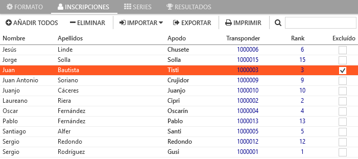

# :fontawesome-solid-gavel: Sanciones y correcciones

---

Existen varios tipos de sanciones y correcciones, y cada una debe realizarse en el apartado del programa destinado para ello.

!!! note "Sanciones frecuentes de un vistazo rápido"
	- Sancionar/Corregir **una manga concreta**: Ver [sanciones a nivel de manga](#sanciones-a-nivel-de-manga)
	- Sancionar **la mejor manga**: Ver [sanciones a nivel de sesión](#sanciones-a-nivel-de-sesion)

---

#### Sanciones a nivel de manga

Se realizan desde el apartado de [vueltas](../user-guide/heats.md#vueltas), en donde aparecen la lista de vueltas de cada piloto y una sección en la parte inferior en dónde realizar las correcciones. Existen dos tipos según el estado de la manga:

##### In-Race

Permite hacer correcciones en el número total de vueltas del piloto mientras que la manga está en curso. Esta opción se suele utilizar cuando una pasada por meta no ha sido detectada por el decodificador.

##### Post-Race

Permite hacer correcciones una vez que la manga ha finalizado. Las opciones son:

- **Vueltas**: Permite añadir o quitar vueltas al piloto. Las vueltas modificadas desde la opción In-Race aparecen reflejadas aquí automáticamente al finalizar la manga.

- **Tiempo**: Permite añadir o quitar tiempo al total de la manga del piloto.

- **Sancionada**: Sanciona la manga con pérdida de la misma para el piloto. 
	
	*Al sancionar una manga concreta (generalmente la sanción se aplica a la manga que acaba de concluir), el resto de pilotos que hubiesen quedado por debajo del piloto sancionado, suben de posición.*

Todas las sanciones realizadas tienen efecto inmediato y se puede ver el resultado desde las secciones de resultados del programa (sesión, tanda o manga) o imprimiendo cualquiera de los resultados. Las sanciones aparecerán como notas al pie de los resultados impresos.

---

#### Sanciones a nivel de sesión

Se realizan desde la sección de series, para la sesión correspondiente. En la parte derecha de la lista de pilotos, existen las siguientes opciones:

- **Mejor Manga**: Sanciona al piloto con la pérdida de la mejor manga en esa sesión. Como la mejor manga del piloto no se conoce hasta que han concluido todas las tandas, según se van generando los resultados de carrera, se va seleccionando la mejor en el listado de resultados de la sesión, y esa es la que se deshecha. 

	*Como la mejor manga puede ir variando según avanza la sesión, no se produce ascensión de posición de los pilotos que están situados por debajo del piloto sancionado. En caso de querer que sí se produzca la ascensión, habría que esperar al final de sesión y sancionar la mejor manga de forma directa (sanción a nivel de manga).*

- **Excluído**: Sitúa al piloto en último lugar para esa sesión y evita que participe en la generación automática de nuevas series.

---

#### Sanciones a nivel de carrera

Se realizan desde la sección de inscripciones del programa. Existe una única opción:

- **Excluído**: Sitúa al piloto en último lugar en todas las sesiones en las que participe y evita que participe en la generación automática de nuevas series.

