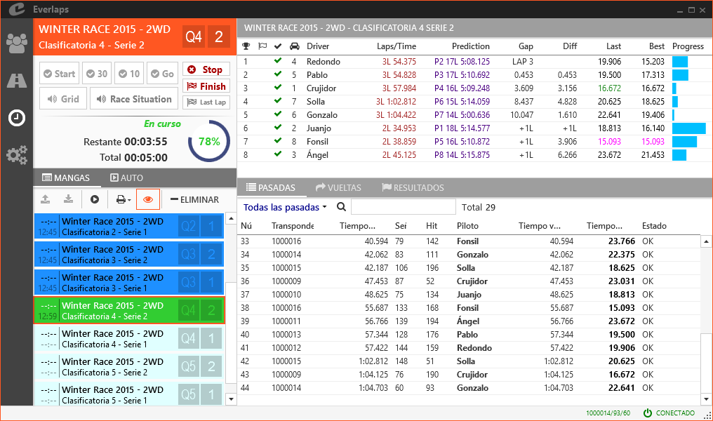

# EVERLAPS - Soluciones profesionales para el cronometraje deportivo

## Características

- **Sencillez**: Everlaps ha sido diseñado para que su manejo sea extremadamente sencillo e intuitivo, sin restar funcionalidad para acometer cualquier tarea necesaria en un sistema de cronometraje profesional.

	*Echando un vistazo a la guía de [inicio rápido](quick-start.md) se puede instalar y comenzar a manejar el programa en minutos.*

- **Fiabilidad**: Diseñado y desarrollado con el objetivo de garantizar la máxima fiabilidad y flexibilidad durante el cronometraje.

	*Además de utilizarse en varios de los eventos más relevantes a nivel nacional, es el software oficial de las SNS (Spanish National Series).*

- **Locución**: Everlaps utiliza un sintetizador de voz para ofrecer información útil a los pilotos y público durante la carrera (parrilla de salida, tiempo restante, situación actual de carrera, etc...).
 
	*Es el único programa del mercado capaz de informar de la situación real de carrera en una manga clasificatoria.*
 
- **Formatos de cronometraje**: Clasificatoria, final, recolocación a 3 vueltas, formato piramidal, entrenamiento libre...

- **Tiempos en directo (*Live Timing*)**: Se puede visualizar la situación de carrera en tiempo real en cualquier dispositivo móvil conectado a la red WiFi del circuito o en Internet. 

- **Evolución constante**: A diferencia de la mayoría del software de cronometraje existente, Everlaps sigue evolucionando continuamente con nuevas características y funcionalidades.

## Documentación

Esta documentación está estructurada de la siguiente forma:

- [**Inicio rápido**](quick-start.md): Instala el programa y comienza a cronometrar con un vistazo general a las opciones más relevantes.

- **Manual detallado**: Descripción de todas las opciones del programa.
	- [**Pilotos**](user-guide/drivers.md)
	- [**Carreras**](user-guide/races.md)
	- [**Mangas**](user-guide/heats.md)
	- [**Configuración**](user-guide/config.md)
	- [**Opciones de línea de comandos**](user-guide/commands.md)

- **Formatos de carrera**: Descripción de cada uno de los formatos soportados.
 
	- [**Clasificatorias y finales**](race-formats/qualify-finals.md)
	- [**Formato piramidal**](race-formats/christmas-tree.md)
	- [**Entrenamiento libre**](race-formats/free-practice.md)

- **Tareas frecuentes**: Descripción las tareas habituales a las que se enfrenta el cronometrador durante la carrera.
	- [**Sanciones y correcciones**](common-tasks/punishments-corrections.md)
	- [**Cambiar transponders**](common-tasks/change-transponders.md)
	- [**Inscripciones con la carrera en marcha**](common-tasks/late-entries.md)
	- [**Etiquetas**](common-tasks/tags.md)

## Contacto

Puedes contactar con nosotros en [info@everlaps.com](mailto:info@everlaps.com)
