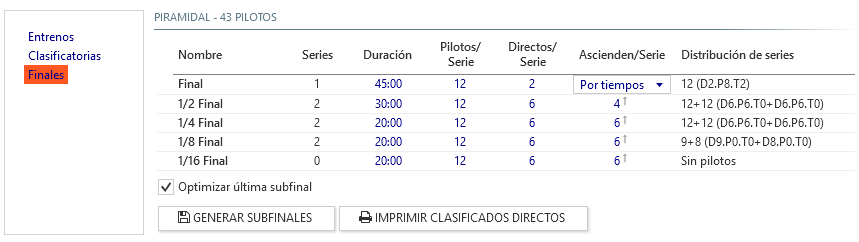

# Formato piramidal

El formato piramidal se caracteriza por establecer una sistema de subfinales en forma de pirámide o árbol de navidad (*Christmas tree* en inglés) que permite que cualquier piloto pueda ascender desde las finales inferiores a la final absoluta, aún cuando haya clasificado en último lugar durante la sesión clasificatoria. 

Las sesiones anteriores a las finales (entrenos, recolocación y/o clasificación) mantienen el mismo formato definido en las carreras de tipo [clasificatorias y finales](./qualify-finals.md), por lo que en este apartado se explicará exclusivamente el funcionamiento del formato piramidal (subfinales).

### Configuración de subfinales y final

!!! note
	El número de pilotos que se utiliza para el cálculo de la distribución de las subfinales se obtiene de la lista de inscripciones, exceptuando aquellos pilotos excluídos de la carrera o de la sesión clasificatoria. Esto es especialmente útil para afinar la distribución en el caso de existir pilotos que estén inscritos pero no vayan a disputar la carrera, o que hayan abandonado después de las clasificatorias.

- **Nombre**: Define la subfinal o final. Se establece automáticamente.

- **Series**: Número de series que intervienen en las subfinales, calculado automáticamente. Cada subfinal tiene siempre dos series, excepto:

	- La final, siempre tiene una única serie.
	- La subfinal más baja, si el número de pilotos que forman esa subfinal es igual o menor que el número de *Pilotos/Serie* y está marcada la opción de *Optimizar última subfinal*, se fusiona en una única serie.

- **Duración**: Duración de cada manga de la subfinal o final.

- **Pilotos/Serie**: Número máximo de pilotos en cada serie de la subfinal o final.

- **Directos/Serie**: Número de pilotos que pasan directamente a cada subfinal o final según el resultado de las clasificatorias. En el ejemplo de la imagen superior, los dos primeros clasificados pasan directamente a la final.

- **Ascienden/Serie**: Número de pilotos por serie que ascienden a la siguiente subfinal según su posición obtenida en la subfinal actual. 

	*En el ejemplo de la imagen, por ejemplo de la semifinal a la final pasan 4 pilotos por serie (8 en total: los 4 primeros de la semifinal A y los 4 primeros de la semifinal B).*

	La final tiene un tratamiento distinto ya que es el último nivel de la pirámide y no tendría sentido ascender más allá. En este caso se permite seleccionar cómo se genera la parrilla de salida de la final para los pilotos que ascienden por posición desde las subfinales.

	- **Por tiempos**: Se ordenan todos los pilotos de las series A y B según sus *Vueltas/Tiempo* obtenidos en la semifinal y se van añadiendo a la parrilla de salida después de los ascensos directos.
	- **Intercalada**: Se añaden los pilotos intercalando las series: primer puesto de la serie A, primer puesto de la B, segundo de la A, segundo de la B, etc...

	!!! note
		En el caso de que la suma de clasificados directos más los ascensos por posición no completen el total de pilotos por serie, se ascienden el número de pilotos necesarios para completar la/s final/es según su resultado de *Vueltas/Tiempo*.

- **Distribución de pilotos**: Muestra un resumen de la composición de las subfinales según los pilotos inscritos en la carrera para comprobar que los datos introducidos generan la distribución deseada.

	- **Número + número**: pilotos que participan en cada serie.
	- **D**: Número de pilotos que se clasifican directamente por su resultado en las clasificatorias.
	- **P**: Número de pilotos que ascienden de la subfinal anterior según su posición. 
	- **T**: Número de pilotos que ascienden de la subfinal anterior según su resultado de *Vueltas/Tiempo*.
	
##### Acciones adicionales

- **Generar Subfinales**: Inicializa o actualiza la lista de subfinales según los parámetros de configuración introducidos y el número de inscripciones en la carrera.

- **Imprimir clasificados directos**: Una vez finalizadas las mangas clasificatorias, permite generar un listado con la asignación de los pilotos en sus subfinales correspondientes.

!!! warning "Generar Subfinales"
	Después de realizar modificaciones en cualquiera de los parámetros de configuración de la pirámide que hagan variar el número de subfinales, es necesario pulsar *Generar Subfinales* para que se actualice la lista de subfinales que componen la carrera.

	Hasta que no se pulse sobre *Generar Subfinales* al menos una vez no se generará la lista de subfinales para poder generar las series de forma correcta en el panel de [series](../user-guide/races.md#series)