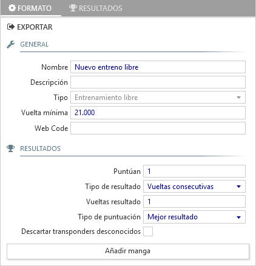

## Entrenamiento libre

El formato de entrenamiento libre tiene un funcionamiento distinto al del resto de formatos de carrera, en los que hay que inscribir previamente a los participantes y generar series para agruparlos.

En el entrenamiento libre existe una única sesión y serie en donde participan todos los pilotos que van saliendo a pista, en una o varias mangas.

##### General

- **Nombre**: Título descriptivo de la tanda de entrenamientos libres.

- **Descripción**: Texto que aparece en la parte inferior de los informes.

- **Tipo**: Permite identificar el formato de carrera. En este caso mostrará siempre *Entrenamiento libre*.

- **Vuelta mínima**: Tiempo mínimo de vuelta al circuito. Una vuelta con tiempo inferior se considera atajo y no se contabiliza.

- **Código Web**: Necesario para poder publicar los tiempos en directo en la web de [Everlaps](http://everlaps.com)

##### Resultado

- **Puntúan**: Número de mangas que se utilizan para obtener el resultado final de cada piloto.

- **Tipo de resultado/Vueltas resultado**: Identifica cómo establecer el resultado de las mangas. Consultar [clasificatorias y finales](./qualify-finals/index.html) para más detalle.

- **Tipo de puntuación**: Identifica como establecer el resultado general del entrenamiento. Consulta [clasificatorias y finales](./qualify-finals/index.html) para más detalle.

- **Descartar transponders desconocidos**: Si está habilitada, las pasadas de los transponders que no figuren en la base de datos son ignoradas.

!!! info ""
	Tener varias mangas de entrenamiento libre es útil porque permite resetear todos los records de los pilotos y comenzar desde cero. Un caso común es que algún piloto ataje y consiga el record absoluto de la manga, con lo cual hasta que no se inicie una nueva este valor se va a mantener.

Al arrancar una manga de entrenamiento libre, la locución irá narrando los tiempos de los pilotos que estén en pista, destacando los records personales y absolutos de la manga. En cualquier momento, mientras la manga está arrancada, se puede imprimir el resultado y obtener la lista de vueltas rápidas de cada piloto.

Si el transponder de un piloto no está registrado las vueltas se mostrarán mientras la manga esté activa bajo el nombre de *Coche* junto con las 3 últimas cifras del transponder del piloto y se notificarán sus tiempos por megafonía, pero las vueltas no se guardarán en la base de datos.

Durante las mangas de entrenamiento se pueden modificar los apodos y transponders de los pilotos directamente desde la [lista de pilotos](../user-guide/drivers/index.html) y los cambios serán aplicados de forma inmediata.

!!! info ""
	Al finalizar manualmente una manga de entrenamiento libre los resultados no se imprimen aunque estuviese activada la opción de *imprimir automáticamente al finalizar cada manga*.
