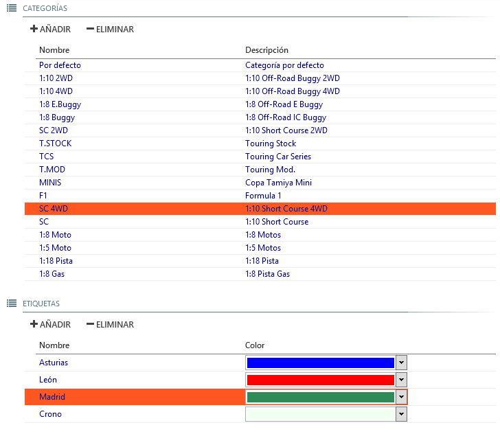

## &fa-gears; Ajustes

Permite configurar los parámetros generales de la aplicación.

## Opciones de configuración

--- 

#### &fa-microphone; Voces

Everlaps necesita de un sistema de síntesis de voz *TTS (Text To Speech)* para poder funcionar. Dos de los sistemas más conocidos son *Ivona* y *Loquendo*, aunque Everlaps puede funcionar con cualquier sistema de *TTS* que soporte el estándar SAPI5.

- **Principal/Secundaria**: Permite seleccionar la voz deseada de entre las disponibles en el sistema. Para mejorar la experiencia se recomienda utilizar una voz femenina como primaria, y una masculina como secundaria (Conchita y Enrique de Ivona, o Carmen y Jorge de Loquendo).

- **Velocidad**: Controla la velocidad de dicción de las voces de forma individual. Ajustar a voluntad según el comportamiento de la voz elegida.

- **Volumen**: Controla el volumen de las voces individualmente.

- **Test**: Permite introducir cualquier texto para que sea pronunciado por la voz al pulsar la tecla INTRO. *Muy útil para realizar avisos personalizados a través de la megafonía del circuito*.

- **Modo de compatibilidad de voz**: Habilitar ***sólo*** en caso de que las voces se queden en silencio. *Ver nota más abajo*.

	!!! warning "Compatibilidad de voz: Loquendo 6.5"
		Si se usa una versión de Loquendo antigua (6.5 o inferior) hay un defecto en las voces que bloquea la locución debido al uso avanzado que hace Everlaps del control de voz. Solamente en este caso se debe marcar la opción *Modo de compatibilidad de voz*. 
	
		Se puede comprobar si ocurre este defecto seleccionando la voz de Loquendo correspondiente y escribiendo en la caja de test lo siguiente:
	
			Uno <silence msec="1000"/> Dos
	
		Si se oye *Uno Dos* con una pausa de 1 segundo entre ambos no existe el defecto y por tanto no es necesario marcar la casilla de compatibilidad; si sólo se oye *Uno* entonces es necesario marcar la casilla.

---

#### &fa-bell-o; Sonidos

Es posible ajustar la forma individual el volumen de cada uno de los sonidos del sistema según las necesidades del circuito.

- **Pasada**: Suena al detectarse la pasada válida de un transponder por línea de meta (excepto si es el coche con mayor número de vueltas, o si la manga ha finalizado)

- **Cabeza de carrera**: La pasada por línea de meta del coche con mayor número de vueltas en ese momento recibe un sonido más agudo, lo cual ayuda a dirección de carrera y al público a identificar quien es el piloto con mayor número de vueltas. 

	!!! note ""
		En una *final*, el sonido de cabeza de carrera es equivalente al piloto que va en primera posición.
	
		En una *manga clasificatoria*, debido a que cada piloto lleva su propio cronómetro, no implica que el piloto sea el que va en cabeza, sino que es el que primero pasa por meta.

- **Inicio de manga/Fin de manga**: Indica el inicio y final de la manga.

	!!! note ""
		En una *final*, el sonido de inicio de manga generalmente implica el arranque del crono. El sonido de fin de manga implica que todos los coches terminan en el siguiente paso por meta.
	
		En una *manga clasificatoria*, el sonido de inicio de manga indica la apertura de pista pero el inicio del crono lo hace el piloto que pasa primero por línea de meta después de la bocina. El sonido de fin de manga tampoco implica obligatoriamente que los coches terminan en el siguiente paso por meta; la locución avisará de los que coches que vayan terminando según su cronómetro individual.

- **Transponder inválido**: Suena cuando se detecta una pasada de un transponder que no pertenece a ningún piloto de la manga activa.

---

#### &fa-bolt; Transponder

El sistema soporta la conexión a diferentes sistemas de detección de pasadas.

- **Decodificador/Parámetros**: Permite seleccionar el decodificador y/o el sistema del conexión. Las opciones disponibles son:

	- **IPDecoder**: Conexión a dispositivos AMB/MyLaps a través de conexión protocolo IP (conexión de cable de red o Ethernet). En el campo **Parámetros** es necesario indicar la dirección IP del decodificador (por ejemplo, 192.168.0.10)

	- **SerialDecoder**: Conexión a dispositivos AMB/MyLaps a través de puerto serie. En el campo **Parámetros** es necesario indicar el puerto en el que está conectado del decodificador (COM1, COM2, etc...)
	
	- **SimulatorDecoder**: Simulador de pasadas que permite probar el funcionamiento del programa generando las pasadas de los pilotos al pulsar sobre los correspondientes botones de transponder o bien configurando el modo automático con el intervalo de tiempo entre pasadas correspondiente.
	
	- **NullDecoder**: No establece conexión con ningún sistema de decodificación.
	
- **Filtrar si hits/señal menor que...**: Para las conexiones a dispositivos AMB/MyLaps, ignora las pasadas con valores de hits o señal menor que los indicados.

- **Permitir transponders alternativos**: Por defecto en una manga sólo se admiten los transponders que aparecen en la inscripción de los pilotos que corren esa manga. Si se habilita esta opción, se permite que aquellos transponders que pertenezcan a un único usuario en la base de datos puedan usarse durante la carrera además del transponder que aparece en la inscripción.

	!!! note ""
		Esto puede resultar útil sobre todo en mangas de entreno, en dónde los pilotos en ocasiones prueban varios coches con distintos transponders para ver con cual correrán la carrera, o bien para "solucionar" el que algunos pilotos no se hayan inscrito con el transponder correcto.
	!!! warning ""
		También se podrían producir efectos colaterales, como que un piloto le deje prestado su transponder a otro, éste no lo comunique, y corriendo en la misma manga el transponder prestado asignará las pasadas al piloto propietario, junto con las de su transponder que aparece en la inscripción.

- **Permitir que un transponder inválido inicie la manga**: Por defecto sólo los transponders válidos pueden iniciar las mangas en las que se espera por la primera pasada para arrancar el crono (generalmente en clasificatorias con salida lanzada o volante). Si se habilita esta opción, se permite que un transponder inválido pueda arrancar el crono. 

	!!! note ""
		Al permitir que un transponde inválido pueda arrancar el crono, el transponder inválido podría asignarse más tarde al piloto correcto y todas sus vueltas (incluyendo esta primera pasada) podrían recuperarse de forma automática; en caso contrario, la primera pasada no quedaría registrada (ya que la manga todavía no ha comenzado) y no podría recuperarse de ninguna manera.

- **Permitir conteo manual**: Habilita en el programa las opciones de conteo manual, para poder contabilizar las pasadas de los pilotos sin transponder manualmente.

	- **Detectar atajos en conteo manual**: Si está habilitada se detectan los atajos entre pasadas manuales y estos no serán contabilizados como vueltas válidas.

	- **Permitir atajos de teclado**: Permite el uso de las teclas **F1 hasta F12** (pilotos del 1 al 12) y **Ctrl+1, Ctrl+2 hasta Ctrl+0** (pilotos del 11 al 20) para generar las pasadas manuales sin tener que utilizar el ratón en la vista de vueltas de la manga activa.

		!!! note "Hot Keys en el conteo manual"
			Las teclas F1 a F11 y todas las combinaciones de Ctrl+número funcionan incluso aunque Everlaps no se encuentre en primer plano, excepto la tecla F12, que es reservada por el sistema operativo, y por ello sólo funciona si Everlaps es la aplicación que se encuentra en primer plano.

---

#### &fa-print; Impresión

- **Imprimir tiempo de carrera en el detalle de vueltas**: En los informes de manga, se incluye el tiempo total de carrera junto al tiempo de vuelta en la información cronológica de cada piloto.

- **Imprimir gráfico en el resultado de manga**: En los informes de manga, muestra un gráfico en donde se ve la evolución de vueltas y posiciones de cada piloto a lo largo del tiempo.

- **Imprimir automáticamente al terminar cada manga**: Al terminar cada manga, se imprime automáticamente el resultado de la manga, así como el resultado de la tanda (en el caso de que la manga recién terminada completase su tanda) y también el resultado de la sesión (si hay 2 o más tandas completadas).

- **Usar lector de PDF para vista previa e impresión**: Al imprimir un informe, se envía al visor de PDF configurado por defecto en el sistema operativo ([Foxit Reader](http://www.foxitsoftware.com/Secure_PDF_Reader), [Adobe Reader](http://get.adobe.com/es/reader), etc...) en vez de a la impresora.

- **Impresora**: Selecciona la impresora del sistema a la que se enviarán los informes, siempre y cuando la opción de *Usar lector de PDF para vista previa e impresión* no esté activada.

---

#### &fa-gear; Opciones por defecto

- **Prólogo/Vuelta mínima/Última vuelta/Tiempo cronos retrasados/Retardo salida lanzada**: Los valores introducidos en estos campos se asignan automáticamente a las nuevas carreras que se generen en el programa. Cada campo se corresponde con su homólogo en la sección de [configuración de carrera](../race-formats/qualify-finals/index.html#comun)

- **Invertir numeración en series de entrenos y clasificatorias**: Por defecto las series en las que el piloto lleva su cronómetro individual se numeran del 1 en adelante, siendo la serie 1 la que contiene los pilotos de mayor rank y que se planifica en último lugar dentro de su tanda. Si está marcada esta opción, las series clasificatorias se numeran en orden inverso (la serie 1 será la de pilotos con menor rank y se planificará en primer lugar).

	!!! note ""
		El orden de ejecución de las mangas en Everlaps no tiene por qué seguirse estrictamente y el cronometrador puede elegir qué manga de la tanda en curso lanzar en cada momento.

---

#### &fa-signal; Red

- **Publicar resultados automáticamente en everlaps.com**: Al finalizar cada manga, se actualizan los resultados hasta el momento en la web de [Everlaps](http://everlaps.com) siempre que se haya introducido el *Código Web* correspondiente en la configuración de la carrera.

	!!! note ""
		Si después de terminar la manga se realiza alguna corrección o sanción sobre la carrera, es necesario volver a publicar los resultados de la carrera de forma manual (Listado de carreras > Botón derecho > Publicar resultados en everlaps.com)

---

#### &fa-rss; Tiempos en directo (*Live Timing*)

Everlaps puede emitir el resultado de una manga en *tiempo real* a través de un servidor web, lo que habilita la posibilidad de visualizar el transcurso de la carrera en cualquier dispositivo con un navegador moderno, como smartphones, tablets y ordenadores.

Aparte de para que tanto los pilotos que están en el box como el público desde el circuito o sus casas puedan seguir la carrera, el sistema de *Live Timing* es especialmente útil en manos del Director de Carrera, ya que le permite tener una visión directa del estado de la misma, en incluso controlar el arranque y parada de la manga en curso.

- **Publicar a servidor local**: Habilita el envío de los datos carrera al servidor local que se ejecuta en el mismo ordenador en dónde está instalado Everlaps. *Ésta es la única opción que se permite si el programa se ejecuta en modo gratuito*.

	!!! note "Servidor local"
		El servidor local es un programa independiente que debe de estar en ejecución para que los dispositivos puedan conectarse al sistema de Live Timing dentro de la red WiFi del circuito. Se encuentra en la carpeta Everlaps, dentro de la lista de programas de Windows, así como en el escritorio, y se identifica por un icono verde titulado *Everlaps Live Timing*.
 
- **Publicar a everlaps.com**: Habilita el envío de los datos a la web de [Live Timing de Everlaps](http://live.everlaps.com), bajo la ruta que se publicará en la página principal de [Everlaps](http://everlaps.com) durante las fechas de realización de la carrera.

- **Servidores personalizados**: Permite el envío a las diferentes direcciones IP o servidores que se indiquen esta casilla (separadas por espacios).

- **Mostrar relojes de repostaje**: Muestra en el [Live Timing](http://live.everlaps.com) (tanto remoto como local) una lista con las distintas estrategias de repostaje y el tiempo que queda para cada parada.

	- **Tiempos mínimo/máximo entre repostajes**: Según la duración de cada carrera y los valores introducidos, correspondientes a los tiempos que puede circular un vehículo hasta agotar su combustible, se generarán las distintas estrategias de repostaje.

- **Permitir control remoto**: Permite el control remoto de la manga desde un dispositivo conectado a la red local del circuito. *Esta opción se encuentra inhabilitada en la versión actual*.

	- **Usuario/Contraseña**: Campos que deben introducirse desde el cliente de *Live Timing* para conceder permiso de control remoto al usuario.

---

#### &fa-database; Archivos

- **Base de datos**: Muestra la ruta al fichero donde se almacenan todos los datos de pilotos y carreras de la aplicación. Este fichero puede moverse entre máquinas, por ejemplo se podría configurar una carrera en otro ordenador (incluso con la versión gratuita), y copiar la base de datos en el ordenador del circuito para arrancar la carrera de forma inmediata.

- **Logotipo**: Permite mostrar un logotipo personalizado en la parte inferior de los informes.

---

#### &fa-globe; Idioma

Permite el cambio de idioma del interfaz y las locuciones de Everlaps

!!! note ""
	Se necesitan voces configuradas en el mismo idioma en el que se establezca el programa

---

#### &fa-bug; Depuración

- **Mostrar consola**: Muestra el registro de actividad del programa (mensajes de voz, acciones, errores...). En caso de problemas, puede servir de ayuda para intentar comprender lo sucedido siguiendo la traza de ejecución del programa.

## Categorías y etiquetas

#### &fa-list; Categorías

Permite añadir, eliminar y modificar categorías. Por defecto se crea una lista con las categorías más habituales, que pueden modificarse a voluntad con la única restricción de la categoría por defecto, que no puede ser eliminada.

#### &fa-list; Etiquetas

Permite añadir, eliminar y modificar etiquetas, asignado un color identificativo junto con su descripción.

El uso de las etiquetas se detalla en el apartado [Etiquetas](../common-tasks/tags/index.html)