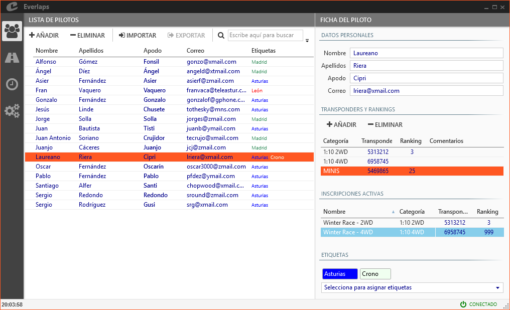

## &fa-users; Pilotos

Permite la gestión de todos los pilotos disponibles en la base de datos del programa.

Lista de términos referentes a la gestión de pilotos:

- **Piloto**: Persona individual que puede ser inscrita en alguna de las carreras configuradas
- **Categoría**: Clasifica las diferentes modalidades según el tipo vehículo
- **Transponder**: Número del transponder personal que utiliza el sistema de conteo de vueltas para identificar al piloto
- **Ranking**: Nivel de habilidad de un piloto en relación al resto
- **Etiqueta**: Permite agrupar pilotos respecto a un identificador común    

Un piloto puede tener asignados diferentes valores de transponder y ranking según las categorías en las que participe, así como cualquier número de etiquetas definidas en el programa.

---

### Lista de pilotos

Permite la introducción, modificación y borrado de los pilotos disponibles.

##### Acciones

- **Añadir**: Inserta una nueva entrada en la lista para poder rellenar los campos correspondientes del piloto.

- **Eliminar**: Borra de la base de datos el piloto o pilotos seleccionados.

- **Importar**: Permite cargar una lista de pilotos desde un fichero.

- **Exportar**: Permite el volcado a fichero de la lista completa de pilotos.

- &fa-search; **(Filtro de búsqueda)**: Realiza un filtrado de los pilotos visibles mostrando aquellos en los que alguno de sus campos (nombre, apellidos, apodo, transponder, categoría, etiquetas, etc...) coinciden total o parcialmente con el texto introducido en el campo de búsqueda. 

##### Campos

- **Nombre y apellidos**: Aparecerán en los listados para identificar inequívocamente al piloto.

- **Apodo**: El apodo se usará en las locuciones para narrar las posiciones y tiempos de los pilotos, así como en el detalle de vueltas de los informes. Puede haber apodos repetidos en la base de datos, pero en una misma serie no está permitido (el programa avisará de tal situación para que sean modificados).

- **Correo**: El correo es la forma que utiliza el programa para emparejar inequívocamente a los pilotos entre la base de datos local y la base de datos disponible en la [web de Everlaps](http://everlaps.com), de forma que permite gestionar las inscripciones y resultados de cada piloto de manera bidireccional.

	Cuando se añaden pilotos de forma manual, es importante introducir correctamente su correo electrónico en caso de que estén ya registrados en [Everlaps](http://everlaps.com) para poder asignar sus resultados de forma correcta.

- **Etiquetas**: Muestra todas las etiquetas asignadas al piloto.

---
	
### Ficha del piloto

Muestra el detalle de todos los datos del piloto, incluyendo además de los datos personales enumerados anteriormente, las listas de transponders y rankings por categoría, las carreras activas en las que participa el piloto, y las etiquetas asignadas al mismo.

#### Transponders, rankings y números de vehículo

Gestiona la lista de transponders, rankings y números de vehículo del piloto según las categorías en las que participa

- **Categoría**: Permite seleccionar entre las disponibles en la lista de [categorías](./config/index.html#categorias)
- **Transponder, rank y vehículo**: Permite asignar los valores correspondientes para el piloto en la categoría seleccionada.

!!! note ""
	Al inscribir un piloto manualmente en una carrera, el sistema compara la categoría de la carrera con las categorías asignadas al piloto para asignar el transponder correspondiente. En caso de que no exista coincidencia, se asigna el transponder asignado a la categoría por defecto. 

#### Inscripciones activas

Lista de las carreras marcadas como activas en las cuales participa el usuario seleccionado.

Es posible modificar el transponder y rank de la inscripción seleccionada desde aquí, de la misma forma que se haría en la sección de [inscripciones](./races/index.html#inscripciones).

#### Etiquetas

Muestra las etiquetas asignadas al usuario.

Las etiquetas permiten filtrar y agrupar de forma rápida a los pilotos en las distintas secciones (lista de pilotos, inscripciones, series...).

Se puede asignar cualquier etiqueta seleccionándola del desplegable inferior, y se puede eliminar haciendo clic sobre la *X* que aparece al situar el cursor del ratón sobre la etiqueta que se desea eliminar. La lista completa está definida en la sección de configuración de [etiquetas](./config/index.html#etiquetas).

