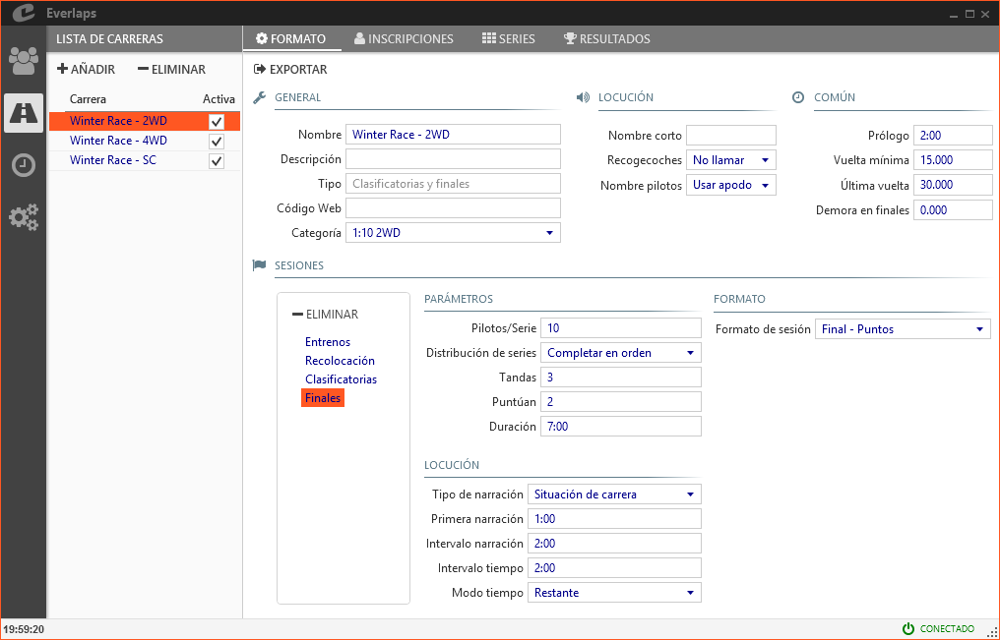
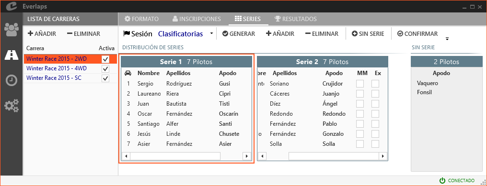
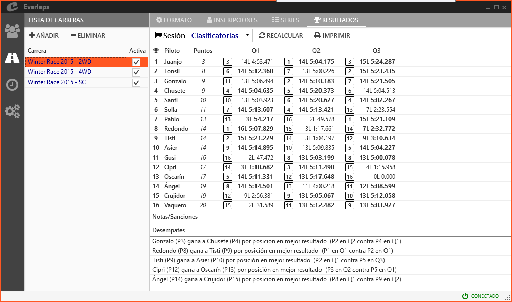

## &fa-road; Carreras

Desde aquí se gestionan las carreras disponibles, así como la configuración de todos sus parámetros.

---

### Lista de carreras

Muestra las carreras disponibles hasta el momento.

##### Acciones disponibles

- **Añadir**: Permite crear una nueva carrera según el formato elegido de entre los disponibles:
	- **Clasificatorias y finales**: Crea una carrera con el formato de [clasificatorias y finales](../race-formats/qualify-finals/index.html)
	- **Clasificatorias, semis y finales**: Crea una carrera con el formato de [formato piramidal](../race-formats/christmas-tree/index.html)
	- **Entrenamiento libre**: Crea una carrera de [entrenamiento libre](../race-formats/free-practice/index.html)
	- **Cargar desde archivo**: Permite crear una nueva carrera a partir de un archivo generado exportando la configuración de una carrera previa.

- **Eliminar**: Borra todos los datos de la carrera seleccionada, incluyendo inscripciones, mangas y resultados.

##### Campos de la carrera

- **Carrera**: Nombre identificativo de la carrera. Se usará en la lista de mangas y en todos los informes.

- **Activa**: Indica si la carrera esta activa en el momento actual. Para las carreras activas se muestran sus mangas en la [lista de mangas](./heats/index.html#mangas_1) y se pueden realizar planificaciones desde el modo automático.

---

### &fa-gear; Formato

##### Acciones disponibles

- **Exportar**: Permite exportar a un archivo la configuración de la carrera, de forma que se puedan crear múltiples carreras con exactamente el mismo formato y parámetros cargando el archivo exportado.

El resto de los parámetros de configuración de la carrera dependen del tipo de carrera elegido. Consultar los formatos de carrera disponibles:

- **[Clasificatorias y finales](../race-formats/qualify-finals/index.html)**
- **[Formato piramidal](../race-formats/christmas-tree/index.html)**
- **[Entrenamiento libre](../race-formats/free-practice/index.html)**

---

### &fa-user; Inscripciones

Permite gestionar las inscripciones de la carrera (excepto para [entrenamiento libre](../race-formats/free-practice/index.html) ya que los pilotos se inscriben automáticamente al pasar por línea de meta).

La pantalla se divide verticalmente en dos partes:

- La parte *superior* contiene los pilotos inscritos en la carrera.
- La parte *inferior* o *lista de pilotos disponibles*, muestra los pilotos almacenados en la base de datos pero que no forman parte de la carrera.

##### Acciones

- **Añadir todos**: Añade todos los pilotos disponibles en la base de datos a la lista de inscritos de la carrera.

- **Eliminar**: Elimina los pilotos seleccionados de la lista de inscritos (pasarán a la *lista de pilotos disponibles*).

- **Importar**: 
	- **Desde archivo local**: Carga la lista de inscritos desde un fichero de texto descargado desde la web de [Everlaps](http://everlaps.com) conteniendo la lista de inscripciones de la carrera.
	- **Desde la web**: Realiza la carga directamente desde la web siempre que se haya introducido el [código web](../race-formats/qualify-finals/index.html#campos-de-formato) de la carrera.
	
	!!! info ""
		Si se importa la lista de pilotos y ya existen pilotos inscritos en la carrera, solamente se añaden aquellos pilotos que aparecen en la lista y que no estuviesen todavía inscritos. De los pilotos ya inscritos se respetan sus valores de transponder y rank.
	
- **Exportar**: Permite el volcado a fichero de la lista de pilotos inscritos.

- **Imprimir**: Imprime la lista de pilotos inscritos junto con su número de transponder.

- &fa-search; **(Filtro de búsqueda)**: Realiza un filtrado de los pilotos inscritos mostrando aquellos en los que alguno de sus campos (Nombre, Apellidos, Apodo, etc...) coinciden total o parcialmente con el texto introducido en el campo de búsqueda. 

##### Campos

- **Nombre, apellidos y apodo**: Estos campos se copian directamente de la base de datos. Si se desean modificar hay que hacerlo desde la pantalla de [pilotos](./drivers/index.html), teniendo en cuenta que el cambio afecta a todas las carreras en las que está inscrito el piloto.

- **Transponder y rank**: Estos campos se pueden modificar y sólo afectan a la carrera seleccionada. Si se modifica un transponder, el programa mostrará un diálogo para permitir establecer ese transponder como valor por defecto en la base de datos para próximas carreras, y si el piloto pertenece a la manga activa de carrera, se mostrará otro diálogo para permitir la modificación en caliente del valor. Ver [cambiar transponders](../common-tasks/change-transponders/index.html) para más información.

- **Excluído**: Sanciona al piloto situándolo en último lugar en todos los resultados de la carrera. Los pilotos excluídos no intervienen en la generación automática de nuevas series. Ver [sanciones y correcciones](../common-tasks/punishments-corrections/index.html) para más información.

#### Pilotos disponibles

En la parte inferior de la pantalla se muestra la lista de pilotos disponibles en la base de datos pero que no están inscritos en la carrera seleccionada.

##### Acciones

- &fa-search; **(Filtro de búsqueda)**: Realiza un filtrado de los pilotos que todavía no pertenecen a la carrera mostrando aquellos en los que alguno de sus campos (Nombre, Apellidos, Apodo, etc...) coinciden total o parcialmente con el texto introducido en el campo de búsqueda. 

---

### &fa-th; Series

La pantalla de series se divide horizontalmente en dos partes:

 - La parte derecha, *distribución de series*, contiene la lista de series para la sesión seleccionada y los pilotos que las componen.
 - La parte izquierda, *pilotos sin serie*, contiene la lista de pilotos inscritos en la carrera pero que no pertenecen a ninguna serie de la sesión seleccionada.

##### Acciones

- **Sesión**: Selecciona la sesión de la cual se mostrar las series

- **Generar**: Genera una distribución automática con el número de pilotos por serie indicado en la configuración de la sesión, y siguiendo el orden de rank o bien el resultado de una sesión anterior, según los parámetros elegidos en el diálogo siguiente:
	
	

	- **Rank de pilotos**: El orden de pilotos se define por el número de rank.
	- **Copiar de la sesión**: Se copia exactamente la misma distribución de pilotos establecida en la sesión seleccionada en la lista inferior.
	- **Resultado de la sesión**: El orden de pilotos se define por el resultado de la sesión seleccionada en la lista inferior.

		!!! info ""
			Al generar las mangas basándose en el resultado de una sesión anterior, se ignoran aquellos pilotos que hayan sido excluídos tanto de la carrera (panel de inscripciones) como de la sesión de la cual se obtiene el resultado para generar la nueva distribución (panel de series).

- **Añadir**: Añade una serie vacía

- **Eliminar**: Elimina la serie seleccionada. Los pilotos que perteneciesen a la serie pasan a la lista de *pilotos sin serie*.

- **Sin serie**: Añade a la última serie todos los pilotos que todavía no pertenecen a ninguna serie.

- **Confirmar**: Genera las mangas según la distribución de series.

	!!! info ""
		Si después de confirmar las mangas se añaden nuevas series, se puede volver a *Confirmar* y se crearán las mangas pertenecientes a las nuevas series. También es posible reorganizar los pilotos una vez confirmadas las mangas, el programa es totalmente flexible en este aspecto.

- **Imprimir**: Imprime la lista de series junto con los pilotos que pertenecen a cada una de ellas.

#### Distribución de series

Los pilotos que aparecen dentro de cada serie pueden arrastrarse dentro de la misma serie o entre series diferentes para modificar su posición.

##### Campos

- **Nombre, apellidos y apodo**: Son los datos del piloto tal y como aparecen en la base de datos.

- **Mejor Manga**: Permite sancionar la mejor manga del piloto en esa sesión. Ver [sanciones y correcciones](../common-tasks/punishments-corrections/index.html) para más información.

- **Excluído**: Sanciona al piloto pasando a ocupar el último puesto en los resultados de esa sesión. Los pilotos excluídos no intervienen en la generación automática de nuevas series. Ver [sanciones y correcciones](../common-tasks/punishments-corrections/index.html) para más información.

#### Pilotos sin serie

Se muestra en la parte derecha de la pantalla, y contiene todos los pilotos inscritos en la carrera que todavía no pertenecen a ninguna serie en la sesión seleccionada. Los pilotos que aparecen en esta lista se pueden arrastrar a las series correspondientes y viceversa.

!!! info ""
	Si una vez generadas las series se inscriben nuevos pilotos, estos aparecerán en la lista de *pilotos sin serie* y se podrán arrastrar a las series existentes o crear una nueva serie para ellos. En éste último caso habría que volver a ejecutar la acción de *confirmar* para que el programa genere las mangas pertenecientes a las nuevas series.
	
	En cualquier caso, no es necesario volver a generar las series ya existentes.
	
---

### &fa-trophy; Resultados

Muestra el resultado de la sesión seleccionada, con el detalle por piloto en cada una de las tandas que han concluido hasta el momento, así como el detalle de desempates, correcciones y sanciones establecidas para sesión.

##### Acciones

- **Sesión**: Seleccionar la sesión de la que se quieren consultar los resultados

- **Recalcular**: Actualiza el resultado para el caso de que haya una manga activa que intervenga en el resultado general de la sesión.

- **Imprimir**: Imprime el resultado de la sesión seleccionada.